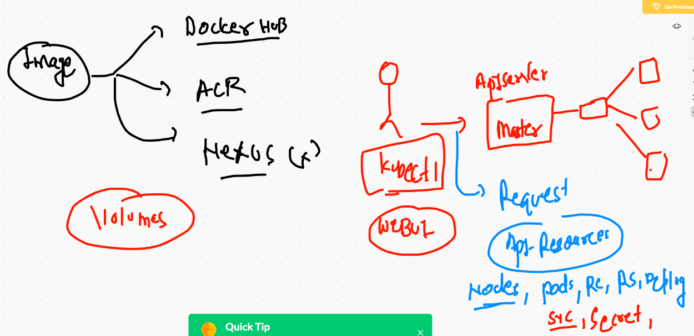
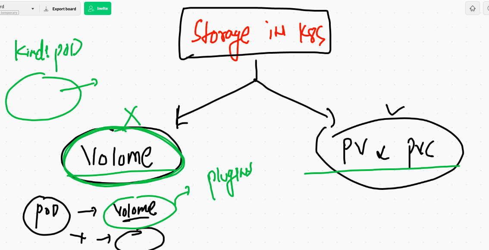
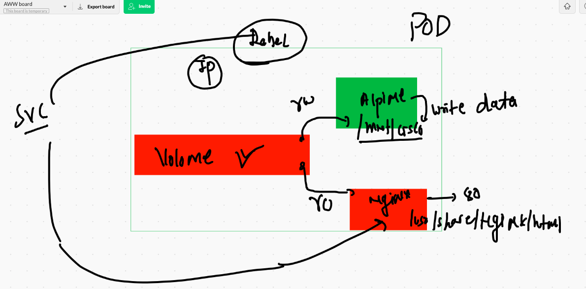
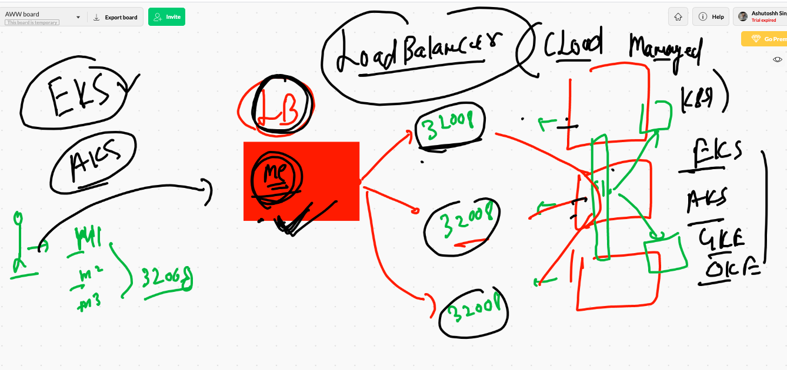
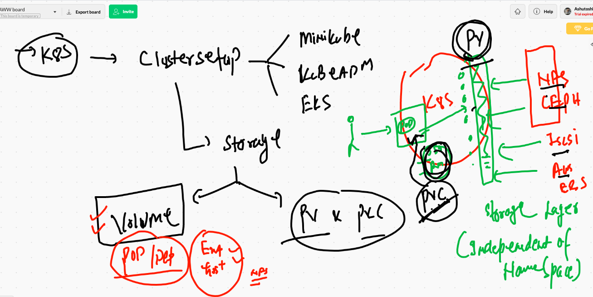
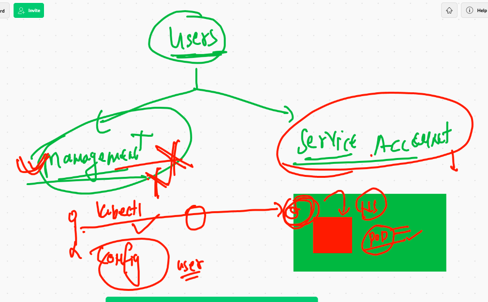
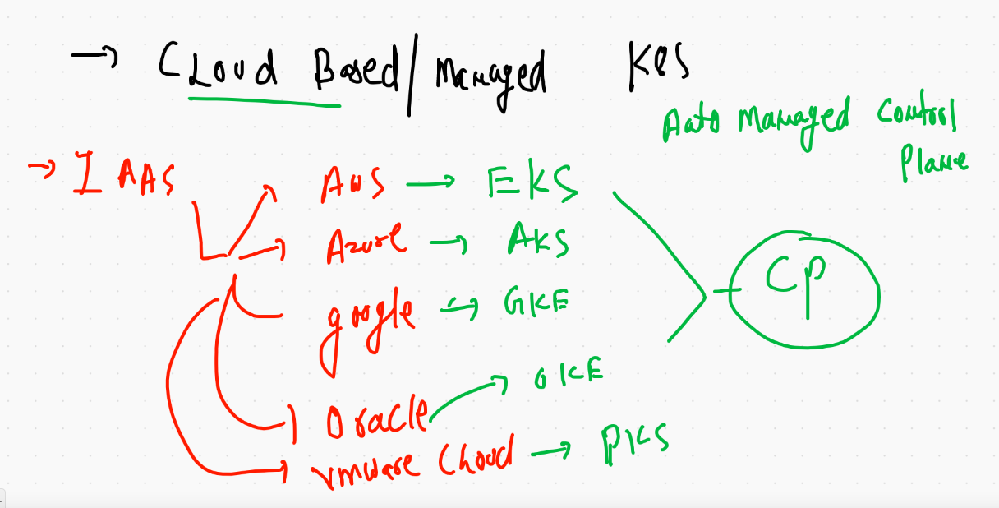
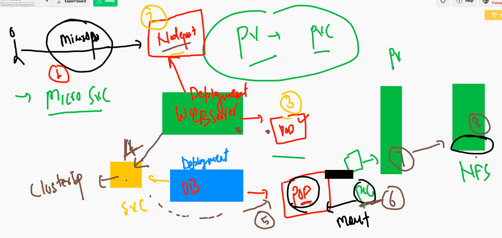

# FInal day

## kubernetes revision 




## type of storage 


## volume explain 



# EmptyDir Volume Example 

## pod creation 

```
❯ kubectl run  ashuemppod  --image=alpine  --command ping fb.com  --namespace ashu-space --dry-run=client -o yaml
apiVersion: v1
kind: Pod
metadata:
  creationTimestamp: null
  labels:
    run: ashuemppod
  name: ashuemppod
  namespace: ashu-space
spec:
  containers:
  - command:
    - ping
    - fb.com
    image: alpine
    name: ashuemppod
    resources: {}
  dnsPolicy: ClusterFirst
  restartPolicy: Always
status: {}
❯ kubectl run  ashuemppod  --image=alpine  --command ping fb.com  --namespace ashu-space --dry-run=client -o yaml >emppod.yml


```

## POD with Volume 

```

apiVersion: v1
kind: Pod
metadata:
  creationTimestamp: null
  labels:
    run: ashuemppod
  name: ashuemppod
  namespace: ashu-space
spec:
  volumes:
  - name: ashuvol1 # name of volume that will be created 
    emptyDir: {}  # will take storage from random location from that minion node where it will be scheduled
  containers:
  - command:
    - ping
    - fb.com
    image: alpine
    name: ashuemppod
    volumeMounts:
    - name: ashuvol1 # same volume as above we created 
      mountPath: /mnt/cisco #this directory will be created on the POD 
    resources: {}
  dnsPolicy: ClusterFirst
  restartPolicy: Always
  
  ```
  
 ## Empty access
 
 ```
  kubectl  get  po -n ashu-space
NAME         READY   STATUS    RESTARTS   AGE
ashuemppod   1/1     Running   0          92s
❯ 
❯ kubectl exec -it  ashuemppod  -n ashu-space  -- sh
/ # 
/ # cd  /mnt/
/mnt # ls
cisco
/mnt # cd  cisco/
/mnt/cisco # s
sh: s: not found
/mnt/cisco # ls

```


## changing script 

```
❯ kubectl replace -f emppod.yml --force
pod "ashuemppod" deleted
pod/ashuemppod replaced
❯ kubectl  get  po -n ashu-space
NAME         READY   STATUS    RESTARTS   AGE
ashuemppod   1/1     Running   0          12s
❯ kubectl exec -it  ashuemppod  -n ashu-space  -- sh
/ # cd /mnt/cisco/
/mnt/cisco # ls
time.txt
/mnt/cisco # cat  time.txt 
Fri Jan  8 04:42:44 UTC 2021
Fri Jan  8 04:42:47 UTC 2021
Fri Jan  8 04:42:50 UTC 2021
Fri Jan  8 04:42:53 UTC 2021
Fri Jan  8 04:42:56 UTC 2021

```

## Multi container POd 

```
❯ cat  emppod.yml
apiVersion: v1
kind: Pod
metadata:
  creationTimestamp: null
  labels:
    run: ashuemppod
    x: helloashu
  name: ashuemppod
  namespace: ashu-space
spec:
  nodeName: worker1  # static scheduling 
  volumes:
  - name: ashuvol1 # name of volume that will be created 
    emptyDir: {}  # will take storage from random location from that minion node where it will be scheduled
  containers:
  - command: ["/bin/sh","-c","while true;do date >>/mnt/cisco/index.html; sleep 3 ; done"]
    image: alpine
    name: ashuemppod
    volumeMounts:
    - name: ashuvol1 # same volume as above we created 
      mountPath: /mnt/cisco #this directory will be created on the POD automatically if not present 

  - image: nginx
    name: ashungc1 
    ports:
    - containerPort: 80
    volumeMounts: 
    - name: ashuvol1 
      mountPath: /usr/share/nginx/html  
    resources: {}
  dnsPolicy: ClusterFirst
  restartPolicy: Always
  
  ```
  
  ## multi container images pod
  
  
  
  ```
  
  ❯ cat  emppod.yml
apiVersion: v1
kind: Pod
metadata:
  creationTimestamp: null
  labels:
    run: ashuemppod
    x: helloashu
  name: ashuemppod
  namespace: ashu-space
spec:
  nodeName: worker1  # static scheduling 
  volumes:
  - name: ashuvol1 # name of volume that will be created 
    emptyDir: {}  # will take storage from random location from that minion node where it will be scheduled
  containers:
  - command: ["/bin/sh","-c","while true;do date >>/mnt/cisco/index.html; sleep 3 ; done"]
    image: alpine
    name: ashuemppod
    volumeMounts:
    - name: ashuvol1 # same volume as above we created 
      mountPath: /mnt/cisco #this directory will be created on the POD automatically if not present 

  - image: nginx
    name: ashungc1 
    ports:
    - containerPort: 80
    volumeMounts: 
    - name: ashuvol1 
      mountPath: /usr/share/nginx/html  
    resources: {}
  dnsPolicy: ClusterFirst
  restartPolicy: Always
status: {}
❯ kubectl replace -f  emppod.yml --force
pod "ashuemppod" deleted
pod/ashuemppod replaced

```

# HostPath volume 

```
apiVersion: v1
kind: Pod
metadata:
  creationTimestamp: null
  labels:
    run: hostpod
  name: hostpod
spec:
  volumes:
  - name: ashuvol2
    hostPath:
     path: /data123  # location from Minion Node
     type: DirectoryOrCreate  # check if not present on the host then create it 
  - name: ashuvol3
    emptyDir: {} 
  containers:
  - image: alpine
    name: hostpod
    command: ["/bin/sh","-c","while true;do cal >>/mnt/data.txt;sleep 5 ;done"]
    volumeMounts:
    - name: ashuvol2
      mountPath: /mnt/
    - name: ashuvol3
      mountPath: /datanew  
    resources: {}
  dnsPolicy: ClusterFirst
  restartPolicy: Always
  
  ```
  
  # portainer with Deployment 
  
  ```
  ❯ cat portainer.yml
apiVersion: apps/v1
kind: Deployment
metadata:
  creationTimestamp: null
  labels:
    app: portainer
  name: portainer
spec:
  replicas: 1
  selector:
    matchLabels:
      app: portainer
  strategy: {}
  template:
    metadata:
      creationTimestamp: null
      labels:
        app: portainer
    spec:
      volumes:
      - name: ashuweb
        hostPath:
         path: /var/run/docker.sock
         type: Socket
      containers:
      - image: portainer/portainer
        name: portainer
        ports:
        - containerPort: 9000
        volumeMounts:
        - name: ashuweb
          mountPath: /var/run/docker.sock
        resources: {}
        
  ```
  
  # LoadBalancer service 
  
  
  
  # Persistent volume (PV)
  
  
  
  ## PV 
  
  ```
  ❯ cat ashupv.yaml
apiVersion: v1
kind: PersistentVolume
metadata:
  name: ashu-pv-1
spec:
  capacity:
    storage: 5Gi
  accessModes:
    - ReadWriteMany   # ReadWriteOnce , ReadOnlyMany , ReadWriteMany 
  nfs:
    server: 172.31.25.191  # IP of NFS server 
    path: /storage/ashu  # location of NFS server 
    
```

## PVC

```

❯ cat ashu-pvc.yml
apiVersion: v1
kind: PersistentVolumeClaim
metadata:
  name: ashu-pvc
  namespace: ashu-space 
spec:
  accessModes:
    - ReadWriteMany
  storageClassName: ""
  resources:
    requests:
      storage: 2Gi
      
```

## pvc bound 

```
❯ kubectl apply -f ashu-pvc.yml
persistentvolumeclaim/ashu-pvc created
❯ kubectl get pvc -n ashu-space
NAME       STATUS   VOLUME        CAPACITY   ACCESS MODES   STORAGECLASS   AGE
ashu-pvc   Bound    saurav-pv-1   2Gi        RWX                           7s
❯ kubectl get pv
NAME          CAPACITY   ACCESS MODES   RECLAIM POLICY   STATUS      CLAIM                 STORAGECLASS   REASON   AGE
ashu-pv-1     5Gi        RWX            Retain           Available                                                 4m26s
ragpv1        2Gi        RWX            Retain           Available                                                 6m22s
saurav-pv-1   2Gi        RWX            Retain           Bound       ashu-space/ashu-pvc

```

# Users in k8s



```
❯ kubectl  get  serviceaccount -n ashu-space
NAME      SECRETS   AGE
default   1         24h
❯ kubectl  get  sa  -n ashu-space
NAME      SECRETS   AGE
default   1         24h

```

## service account 

```
❯ kubectl get  sa  -n ashu-space
NAME      SECRETS   AGE
default   1         26h
❯ kubectl get  secret   -n ashu-space
NAME                  TYPE                                  DATA   AGE
ashudbsec             Opaque                                1      21h
ashuimgcred           kubernetes.io/dockerconfigjson        1      22h
assuracred            kubernetes.io/dockerconfigjson        1      22h
default-token-9ngzx   kubernetes.io/service-account-token   3      26h
❯ kubectl describe   secret  default-token-9ngzx   -n ashu-space
Name:         default-token-9ngzx
Namespace:    ashu-space
Labels:       <none>
Annotations:  kubernetes.io/service-account.name: default
              kubernetes.io/service-account.uid: ffd043fe-eaa2-40f8-a93f-9574216b52c2

Type:  kubernetes.io/service-account-token

Data
====
ca.crt:     1066 bytes
namespace:  10 bytes
token:      eyJhbGciOiJSUzI1NiIsImtpZCI6IkE0c3ZvMmRJYjZHRXQwQkp1SkZlSjFHTTRaamlCYmk2bXpCekctc0I5Z1EifQ.eyJpc3MiOiJrdWJlcm5ldGVzL3NlcnZpY2VhY2NvdW50Iiwia3ViZXJuZXRlcy5pby9zZXJ2aWNlYWNjb3VudC9uYW1lc3BhY2UiOiJhc2h1LXNwYWNlIiwia3ViZXJuZXRlcy5pby9zZXJ2aWNlYWNjb3VudC9zZWNyZXQubmFtZSI6ImRlZmF1bHQtdG9rZW4tOW5nengiLCJrdWJlcm5ldGVzLmlvL3NlcnZpY2VhY2NvdW50L3NlcnZpY2UtYWNjb3VudC5uYW1lIjoiZGVmYXVsdCIsImt1YmVybmV0ZXMuaW8

```

# Deployment of Dashboard in kubernetes 

```
❯ kubectl apply -f https://raw.githubusercontent.com/kubernetes/dashboard/v2.0.0/aio/deploy/recommended.yaml
namespace/kubernetes-dashboard created
serviceaccount/kubernetes-dashboard created
service/kubernetes-dashboard created
secret/kubernetes-dashboard-certs created
secret/kubernetes-dashboard-csrf created
secret/kubernetes-dashboard-key-holder created
configmap/kubernetes-dashboard-settings created
role.rbac.authorization.k8s.io/kubernetes-dashboard created
clusterrole.rbac.authorization.k8s.io/kubernetes-dashboard created
rolebinding.rbac.authorization.k8s.io/kubernetes-dashboard created
clusterrolebinding.rbac.authorization.k8s.io/kubernetes-dashboard created
deployment.apps/kubernetes-dashboard created
service/dashboard-metrics-scraper created
deployment.apps/dashboard-metrics-scraper created
❯ kubectl   get  ns
NAME                   STATUS   AGE
ashu-space             Active   26h
chandranamespace       Active   26h
default                Active   2d1h
kube-node-lease        Active   2d1h
kube-public            Active   2d1h
kube-system            Active   2d1h
kubernetes-dashboard   Active   17s
rag-space              Active   26h
saurav-space           Active   26h
surabhi-space          Active   4h9m
❯ kubectl  get  deployment -n kubernetes-dashboard
NAME                        READY   UP-TO-DATE   AVAILABLE   AGE
dashboard-metrics-scraper   1/1     1            1           48s
kubernetes-dashboard        1/1     1            1           48s
❯ kubectl  get  po -n kubernetes-dashboard
NAME                                         READY   STATUS    RESTARTS   AGE
dashboard-metrics-scraper-7b59f7d4df-r8c26   1/1     Running   0          63s
kubernetes-dashboard-74d688b6bc-pq4jv        1/1     Running   0          63s
❯ kubectl  get  svc  -n kubernetes-dashboard
NAME                        TYPE        CLUSTER-IP      EXTERNAL-IP   PORT(S)    AGE
dashboard-metrics-scraper   ClusterIP   10.98.51.158    <none>        8000/TCP   75s
kubernetes-dashboard        ClusterIP   10.101.36.245   <none>        443/TCP    76s
❯ kubectl  get  sa  -n kubernetes-dashboard
NAME                   SECRETS   AGE
default                1         104s
kubernetes-dashboard   1         104s
❯ kubectl  get  secret   -n kubernetes-dashboard
NAME                               TYPE                                  DATA   AGE
default-token-t9bnj                kubernetes.io/service-account-token   3      115s
kubernetes-dashboard-certs         Opaque                                0      115s
kubernetes-dashboard-csrf          Opaque                                1      115s
kubernetes-dashboard-key-holder    Opaque                                2      115s
kubernetes-dashboard-token-bcx2g   kubernetes.io/service-account-token   3      115s


```

## check secret 

```
❯ kubectl  get  sa -n kubernetes-dashboard
NAME                   SECRETS   AGE
default                1         7m11s
kubernetes-dashboard   1         7m11s
❯ kubectl  get  secret  -n kubernetes-dashboard
NAME                               TYPE                                  DATA   AGE
default-token-t9bnj                kubernetes.io/service-account-token   3      7m18s
kubernetes-dashboard-certs         Opaque                                0      7m18s
kubernetes-dashboard-csrf          Opaque                                1      7m18s
kubernetes-dashboard-key-holder    Opaque                                2      7m18s
kubernetes-dashboard-token-bcx2g   kubernetes.io/service-account-token   3      7m18s
❯ kubectl describe   secret  kubernetes-dashboard-token-bcx2g   -n kubernetes-dashboard
Name:         kubernetes-dashboard-token-bcx2g
Namespace:    kubernetes-dashboard
Labels:       <none>
Annotations:  kubernetes.io/service-account.name: kubernetes-dashboard
              kubernetes.io/service-account.uid: ea3cc437-b58e-4c10-96c1-f981602208fc

Type:  kubernetes.io/service-account-token

Data
====
namespace:  20 bytes
token:      eyJhbGciOiJSUzI1NiIsImtpZCI6IkE0c3ZvMmRJYjZHRXQwQkp1SkZlSjFHTTRaamlCYmk2bXpCekctc0I5Z1EifQ.eyJpc3MiOiJrdWJlcm5ldGVzL3NlcnZpY2VhY2NvdW50Iiwia3ViZXJuZXRlcy5pby9zZXJ2aWNlYWNjb3VudC9uYW1lc3BhY2UiOiJrdWJlcm5ldGVzLWRhc2hib2FyZCIsImt1YmVybmV0ZXMuaW8vc2VydmljZWFjY291bnQvc2VjcmV0Lm5hbWUiOiJrdWJlcm5ldGVzLWRhc2hib2FyZC10b2tlbi1iY3gyZyIsImt1YmVybmV0ZXMuaW8vc2VydmljZWFjY291bnQvc2VydmljZS1hY2NvdW50Lm5hbWUiOiJrdWJlcm5ldGVzLWRhc2hib2FyZCIsImt1YmVybmV0ZXMuaW8vc2VydmljZWFjY291bnQvc2VydmljZS1hY2NvdW50LnVpZCI6ImVhM2NjNDM3LWI1OGUtNGMxMC05NmMxLWY5ODE2MDIyMDhmYyIsInN1YiI6InN5c3RlbTpzZXJ2aWNlYWNjb3VudDprdWJlcm5ldGVzLWRhc2hib2FyZDprdWJlcm5ldGVzLWRhc2hib2FyZCJ9.u9jep1JGVBV3yb9gS2Z7-RC4Ga2CXigF12GtdcqsAgIRBeOdyaXo_LORZ_ndtOiRsh6geEqQnzRmM9mVz37RKUjgIB6pbNHa-5KnYOumqwL6WHBDUf0wJdEWEJlYK6w30Vazhmhc4JKtmEPYSILesnFcZ10v1aaB2Fjo4NSDNcIqP7CQJL_pbARycXZPcJ2ywrxyufiiovOa-QhIzp2_oMdTM_U7ls6_GuRWhUf0dFRhVeyBm-Vx7FeylC6Gr8z2723d4yltjIPdQeIVjcL5-XK88TYhzlmA72zjUHhVGBPHA80Wmmdk7P3JK9KhC9W6fzyTdTRQ7nu67g5hnnFicQ

```

## checking clusterrole for dashboard service account 

```
❯ kubectl  get clusterroles
NAME                                                                   CREATED AT
admin                                                                  2021-01-06T07:33:51Z
calico-kube-controllers                                                2021-01-06T09:34:06Z
calico-node                                                            2021-01-06T09:34:06Z
cluster-admin                                                          2021-01-06T07:33:51Z
edit                                                                   2021-01-06T07:33:51Z
kubeadm:get-nodes                                                      2021-01-06T07:33:53Z
kubernetes-dashboard                                                   2021-01-08T08:48:35Z
system:aggregate-to-admin                                              2021-01-06T07:33:51Z
system:aggregate-to-edit                                               2021-01-06T07:33:51Z
system:aggregate-to-view                                               2021-01-06T07:33:51Z
system:auth-delegator     

```

## we bind sa of dashboard to cluster role 

```
❯ cat clusterrolebind.yml
apiVersion: rbac.authorization.k8s.io/v1
kind: ClusterRoleBinding
metadata:
  name: admin-user  # name of cluster role bind api 
roleRef:
  apiGroup: rbac.authorization.k8s.io
  kind: ClusterRole
  name: cluster-admin 
subjects:
- kind: ServiceAccount
  name: kubernetes-dashboard # name of service account 
  namespace: kubernetes-dashboard # namespace 
❯ kubectl apply -f clusterrolebind.yml
clusterrolebinding.rbac.authorization.k8s.io/admin-user created
❯ kubectl get clusterrolebinding -n kubernetes-dashboard

```

## CLoud based kubernetes cluster deployment 



# Microservice sample Desing 




## DB deployment 

### creating a secret 

```
❯ kubectl  create secret generic dbpass  --from-literal  p=Cisco123# -n ashu-space
secret/dbpass created
```

## creating database deployment 

```
kubectl  create deployment  ashudb  --image=mysql:5.6  --dry-run=client -o yaml >ashudb.yml

```

## DB file with secret update

```
❯ cat ashudb.yml
apiVersion: apps/v1
kind: Deployment
metadata:
  creationTimestamp: null
  labels:
    app: ashudb
  name: ashudb
spec:
  replicas: 1
  selector:
    matchLabels:
      app: ashudb
  strategy: {}
  template:
    metadata:
      creationTimestamp: null
      labels:
        app: ashudb
    spec:
      containers:
      - image: mysql:5.6
        name: mysql
        env:
        - name: MYSQL_ROOT_PASSWORD # env variable for mysql image 
          valueFrom:
           secretKeyRef:
            name: dbpass # name of secret 
            key: p  # key name  
        resources: {}
        
 ```
 
## DB deploy with secret and PVC 

```
❯ cat  ashudb.yml
apiVersion: apps/v1
kind: Deployment
metadata:
  creationTimestamp: null
  labels:
    app: ashudb
  name: ashudb
spec:
  replicas: 1
  selector:
    matchLabels:
      app: ashudb
  strategy: {}
  template:
    metadata:
      creationTimestamp: null
      labels:
        app: ashudb
    spec:
      volumes:
      - name: ashudbvol   # name of volume 
        persistentVolumeClaim:  # source of volume 
         claimName: ashu-pvc  # name of PVC 
      containers:
      - image: mysql:5.6
        name: mysql
        volumeMounts:
        - name: ashudbvol  # db VOL 
          mountPath: /var/lib/mysql/  # mysql data store location 
        env:
        - name: MYSQL_ROOT_PASSWORD # env variable for mysql image 
          valueFrom:
           secretKeyRef:
            name: dbpass # name of secret 
            key: p  # key name  
        resources: {}
        
  ```
  
