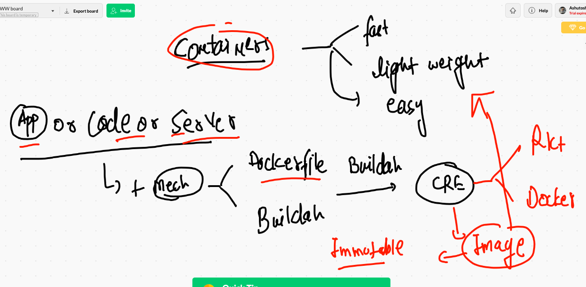
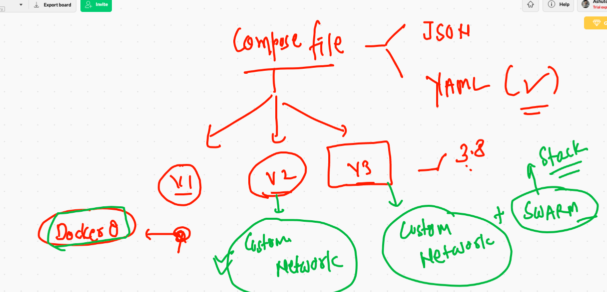
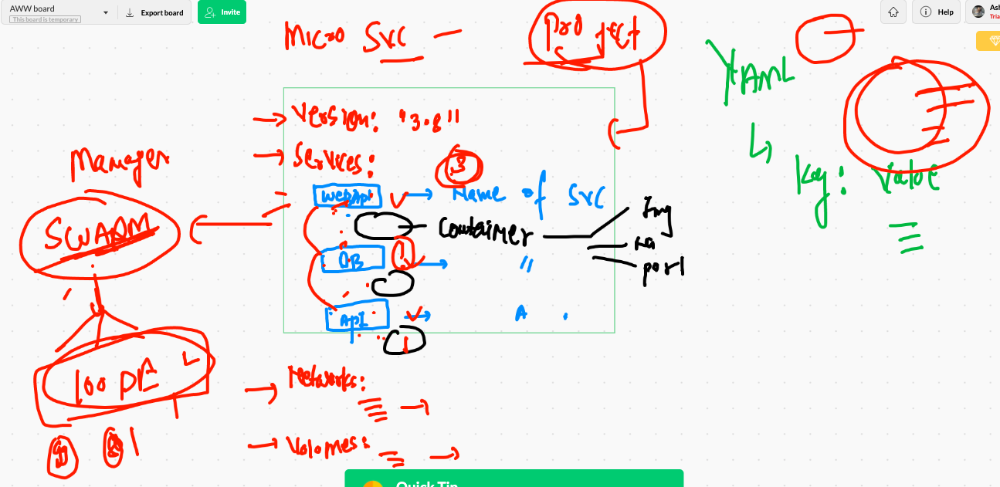

# Docker recap 



## creating and changing context 

```
❯ docker context create  remoteDE  --docker "host=tcp://52.66.251.242:2375"
remoteDE
Successfully created context "remoteDE"
❯ 
❯ docker  context  ls
NAME                TYPE                DESCRIPTION                               DOCKER ENDPOINT               KUBERNETES ENDPOINT   ORCHESTRATOR
default *           moby                Current DOCKER_HOST based configuration   unix:///var/run/docker.sock                         swarm
remoteDE            moby                                                          tcp://52.66.251.242:2375                            
❯ docker  context  use  remoteDE
remoteDE
❯ docker  context  ls
NAME                TYPE                DESCRIPTION                               DOCKER ENDPOINT               KUBERNETES ENDPOINT   ORCHESTRATOR
default             moby                Current DOCKER_HOST based configuration   unix:///var/run/docker.sock                         swarm
remoteDE *          moby                                                          tcp://52.66.251.242:2375                            


```

## Compose file versions



## compose file desing 



## compose example 1 

```
❯ cat docker-compose.yml
version: "3.8"
services:
 ashuwebapp1:  # name of service first 
  image: alpine
  container_name: ashuc1
  command: ping google.com
  
```

## Deploy in remote De 

```
❯ docker-compose up  -d
Creating network "ashuapp11_default" with the default driver
Creating ashuc1 ... done
❯ docker-compose ps
 Name        Command       State   Ports
----------------------------------------
ashuc1   ping google.com   Up           
❯ docker-compose ps
 Name        Command       State   Ports
----------------------------------------
ashuc1   ping google.com   Up           
❯ docker-compose logs
Attaching to ashuc1
ashuc1         | PING google.com (216.58.203.142): 56 data bytes
ashuc1         | 64 bytes from 216.58.203.142: seq=0 ttl=110 time=1.941 ms
ashuc1         | 64 bytes from 216.58.203.142: seq=1 ttl=110 time=1.979 ms
ashuc1         | 64 bytes from 216.58.203.142: seq=2 ttl=110 time=1.985 ms
ashuc1         | 64 bytes from 216.58.203

```


## Example 2 

```
❯ cat docker-compose.yml
version: "3.8"
services:
 ashuwebapp1:  # name of service first 
  image: alpine
  container_name: ashuc1
  command: ping google.com

 ashunginxapp1:  #  name of service second 
  image: nginx
  container_name: ashuc2
  ports:
   - "1199:80"
   
 ```
 
 ## compose related commands
 
 ```
 2979  docker  context  ls
 2980  docker-compose up  -d 
 2981  docker-compose ps
 2982  docker-compose logs 
 2983  ls
 2984  mv docker-compose.yml  ashu.yml
 2985  docker-compose ps
 2986  docker-compose -f  ashu.yml  ps 
 2987  docker-compose -f  ashu.yml  logs
 2988  history
 2989  ls
 2990  mv ashu.yml docker-compose.yml
 2991  docker-compose ps
 2992  docker-compose -v
 2993  docker-compose ps
 2994  docker-compose stop 
 2995  docker-compose ps
 2996  docker-compose start
 2997  history
 2998  docker-compose ps
 2999  docker-compose kill
 3000  docker context  ls
 3001  ls
 3002  docker-compose up -d
 3003  docker-compose -v
 3004  ls
 3005  docker-compose down 
 3006  history
 3007  ls
 3008  which docker-compose 
 3009  ls
 3010  vim  docker-compose.yml
 3011  cat docker-compose.yml
 3012  docker-compose up  -d
 3013  docker-compose ps
 3014  docker-compose kill  ashuwebapp1
 3015  docker-compose ps
 3016  docker-compose start
 3017  docker-compose ps
 3018  docker-compose  logs  ashuwebapp1
 3019  cat docker-compose.yml
 3020  docker-compose  logs  ashunginxapp1
 3021  history
 3022  cat  docker-compose.yml
 3023  docker-compose down
 
 ```
 
 
