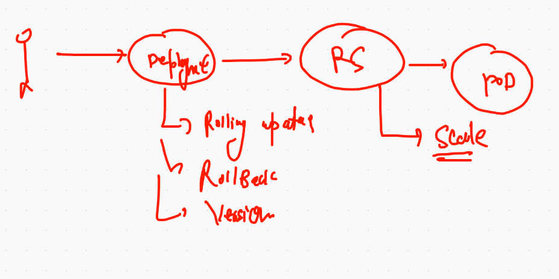

# service and pods in kubernetes 


## Java web app based POD 

```
kubectl  run  ashujavaapp --image=dockerashu/ciscojava:v009  --port 8080 --dry-run=client -o yaml >jsp.yml

```

## pod with labels 

```
❯ cat jsp.yml
apiVersion: v1
kind: Pod
metadata:
  creationTimestamp: null
  labels:  # lable of POD  key: value 
    x: ashujavaapp
  name: ashujavaapp  # name of my POD 
spec:
  containers:
  - image: dockerashu/ciscojava:v009 # image from docker hub 
    name: ashujavaapp  # name container 
    ports:
    - containerPort: 8080  # port of application 
    resources: {}
  dnsPolicy: ClusterFirst
  restartPolicy: Always
  
  ```
  
  ## checking labels and ip of PODs
  
  ## Deleting pod and service
  
  ```
  ❯ kubectl delete all --all
pod "ashujavaapp" deleted
pod "chandrajavaapp" deleted
pod "raithaljavaapp" deleted
pod "sauravjavaapp" deleted
pod "surabhijavaapp" deleted
service "ashusvc11" deleted
service "chandrasvc1" deleted
service "kubernetes" deleted
service "raithasvc1" deleted


```

# Replication controller 


## replication controller

```
❯ cat ashu-rc1.yaml
apiVersion: v1
kind: ReplicationController
metadata:
 name: ashurc-111
 labels:
  x: helloashu

spec:
 replicas: 1  # no of pod 
 template:
  metadata:
   labels:
    app: ashuapp1
  spec:
   containers:
   - image: nginx
     name: ashuc1
     ports:
     - containerPort: 80
     
```

## deployment of RC

```
❯ cat ashu-rc1.yaml
apiVersion: v1
kind: ReplicationController
metadata:
 name: ashurc-111
 labels:
  x: helloashu

spec:
 replicas: 1  # no of pod 
 template:
  metadata:
   labels:
    app: ashuapp1
  spec:
   containers:
   - image: nginx
     name: ashuc1
     ports:
     - containerPort: 80
❯ vim ashu-rc1.yaml
❯ kubectl apply -f  ashu-rc1.yaml
replicationcontroller/ashurc-111 created
❯ kubectl  get  rc
NAME         DESIRED   CURRENT   READY   AGE
ashurc-111   1         1         1       5s
❯ kubectl  get  po
NAME                  READY   STATUS    RESTARTS   AGE
ashurc-111-c24xw      1/1     Running   0          32s
chandrarc-111-9knb9   1/1     Running   0          24s
rag-rc-g76pd          1/1     Running   0          16s

```

  
  ```
  ❯ kubectl get po --show-labels
NAME             READY   STATUS    RESTARTS   AGE     LABELS
ashujavaapp      1/1     Running   0          2m23s   x=ashujavaapp
chandrajavaapp   1/1     Running   0          2m4s    run=chandrajavaapp
raithaljavaapp   1/1     Running   0          88s     run=raithaljavaapp
sauravjavaapp    1/1     Running   0          2m4s    run=sauravjavaapp
❯ kubectl get po --show-labels -o wide
NAME             READY   STATUS    RESTARTS   AGE     IP                NODE      NOMINATED NODE   READINESS GATES   LABELS
ashujavaapp      1/1     Running   0          2m47s   192.168.182.16    worker3   <none>           <none>            x=ashujavaapp
chandrajavaapp   1/1     Running   0          2m28s   192.168.189.80    worker2   <none>           <none>            run=chandrajavaapp
raithaljavaapp   1/1     Running   0          112s    192.168.189.81    worker2   <none>           <none>            run=raithaljavaapp
sauravjavaapp    1/1     Running   0          2m28s   192.168.235.138   worker1   <none>           <none>            run=sauravjavaapp

```

## type of service 


## NodePOrt service 


## Nodeport with LB 


## Nodeport Service creation 

```
❯ kubectl create  service  nodeport ashusvc1  --tcp 1123:8080  --dry-run=client -o yaml
apiVersion: v1
kind: Service
metadata:
  creationTimestamp: null
  labels:
    app: ashusvc1
  name: ashusvc1
spec:
  ports:
  - name: 1123-8080
    port: 1123
    protocol: TCP
    targetPort: 8080
  selector:
    app: ashusvc1
  type: NodePort
status:
  loadBalancer: {}
  
  ```
  
 ## service with updated selector label
 
 
 
 ```
 ❯ cat  mysvc1.yml
apiVersion: v1
kind: Service
metadata:
  creationTimestamp: null
  labels:
    app: ashusvc1
  name: ashusvc1
spec:
  ports:
  - name: 1123-8080
    port: 1123
    protocol: TCP
    targetPort: 8080
  selector:  # to find pod using labels 
   x: ashujavaapp  # label of POD 
  type: NodePort
status:
  loadBalancer: {}
  
 ```
  
## automatically match label of pod during service creation time 

```
❯ kubectl  expose pod ashujavaapp  --type NodePort --port 1234 --target-port 8080 --name ashusvc11
service/ashusvc11 exposed
❯ 
❯ kubectl  get  po
NAME             READY   STATUS    RESTARTS   AGE
ashujavaapp      1/1     Running   0          71m
chandrajavaapp   1/1     Running   0          70m
raithaljavaapp   1/1     Running   0          70m
sauravjavaapp    1/1     Running   0          70m
surabhijavaapp   1/1     Running   0          67m
❯ kubectl  get  svc
NAME         TYPE        CLUSTER-IP       EXTERNAL-IP   PORT(S)          AGE
ashusvc11    NodePort    10.111.230.121   <none>        1234:30140/TCP   9s
kubernetes   ClusterIP   10.96.0.1        <none>        443/TCP          45s

```


# RC 

```

3304  kubectl apply -f  ashu-rc1.yaml
 3305  kubectl  get  rc
 3306  kubectl  get  po
 3307  kubectl get  rc
 3308  kubectl get  pod 
 3309  kubectl delete pod ashurc-111-c24xw
 3310  kubectl get  pod 


```

## expose RC to create service 

```
❯ kubectl get  rc
NAME            DESIRED   CURRENT   READY   AGE
ashurc-111      1         1         1       5m29s
chandrarc-111   1         1         1       5m21s
rag-rc          1         1         1       5m13s
sauravrc-111    1         1         1       3m41s
❯ kubectl  get  po
NAME                  READY   STATUS    RESTARTS   AGE
ashurc-111-zkxdq      1/1     Running   0          4m15s
chandrarc-111-9knb9   1/1     Running   0          5m26s
rag-rc-g76pd          1/1     Running   0          5m18s
sauravrc-111-scdsg    1/1     Running   0          3m46s
❯ 
❯ kubectl expose rc  ashurc-111 --type NodePort --port 1234 --target-port 80 --name ashurcsvc1
service/ashurcsvc1 exposed
❯ kubectl get  svc
NAME         TYPE        CLUSTER-IP      EXTERNAL-IP   PORT(S)          AGE
ashurcsvc1   NodePort    10.109.239.40   <none>        1234:32523/TCP   4s
kubernetes   ClusterIP   10.96.0.1       <none>        443/TCP          14m

```

## scaling app 

```
❯ kubectl scale rc  ashurc-111  --replicas=4
replicationcontroller/ashurc-111 scaled
❯ kubectl  get  rc
NAME            DESIRED   CURRENT   READY   AGE
ashurc-111      4         4         2       15m
chandrarc-111   1         1         1       15m
rag-rc          1         1         1       15m
sauravrc-111    1         1         1       13m
❯ kubectl  get  rc
NAME            DESIRED   CURRENT   READY   AGE
ashurc-111      4         4         4       15m
chandrarc-111   1         1         1       15m
rag-rc          1         1         1       15m
sauravrc-111    1         1         1       13m
❯ kubectl  get  po
NAME                  READY   STATUS    RESTARTS   AGE
ashurc-111-h7pwg      1/1     Running   0          3m39s
ashurc-111-mj572      1/1     Running   0          17s
ashurc-111-pmcb8      1/1     Running   0          17s
ashurc-111-zkxdq      1/1     Running   0          14m

```

# namespace 


## default namespaces

```
❯ kubectl  get  ns
NAME              STATUS   AGE
default           Active   22h
kube-node-lease   Active   22h
kube-public       Active   22h
kube-system       Active   22h
❯ kubectl  get  namespace
NAME              STATUS   AGE
default           Active   22h
kube-node-lease   Active   22h
kube-public       Active   22h
kube-system       Active   22h


```

## kube-system namespace 

```
❯ kubectl  get  po   -n kube-system
NAME                                       READY   STATUS    RESTARTS   AGE
calico-kube-controllers-744cfdf676-nfqcc   1/1     Running   2          21h
calico-node-5b6mh                          1/1     Running   14         21h
calico-node-78ps9                          1/1     Running   2          21h
calico-node-df45c                          1/1     Running   2          21h
calico-node-xfk7t                          1/1     Running   2          21h
coredns-74ff55c5b-dxsb5                    1/1     Running   2          23h
coredns-74ff55c5b-sj4bs                    1/1     Running   2          23h
etcd-k8smaster                             1/1     Running   2          23h
kube-apiserver-k8smaster                   1/1     Running   2          23h
kube-controller-manager-k8smaster          1/1     Running   2          23h
kube-proxy-47knh                           1/1     Running   2          23h
kube-proxy-67v5b                           1/1     Running   2          23h
kube-proxy-jhtbj                           1/1     Running   2          23h
kube-proxy-qnhqc                           1/1     Running   2          23h
kube-scheduler-k8smaster                   1/1     Running   2          23h

```

##  creating namespace 

```
❯ kubectl  create  namespace  ashu-space
namespace/ashu-space created
❯ kubectl  get  ns
NAME              STATUS   AGE
ashu-space        Active   3s
default           Active   23h
kube-node-lease   Active   23h
kube-public       Active   23h
kube-system       Active   23h

```

## define namespace in YAML file 

```
piVersion: v1
kind: ReplicationController
metadata:
 namespace: ashu-space # name of existing namespace 
 name: ashurc-111  # name of Replication controller (RC)
 labels:  # label of RC 
 
 ```
 
## service 

```
❯ kubectl  get  rc -n ashu-space
NAME         DESIRED   CURRENT   READY   AGE
ashurc-111   2         2         2       2m45s
❯ 
❯ kubectl expose rc  ashurc-111 --type NodePort --port 1234 --target-port 80 --name mysvc1 -n ashu-space
service/mysvc1 exposed
❯ kubectl get svc -n ashu-space
NAME     TYPE       CLUSTER-IP      EXTERNAL-IP   PORT(S)          AGE
mysvc1   NodePort   10.110.189.82   <none>        1234:32237/TCP   7s

```

# Deployment in Picture 


## reality of deployment



# Deployment 

```
❯ kubectl  create  deployment  ashujavadep1  --image=dockerashu/ciscojava:v009 --namespace ashu-space  --dry-run=client -o yaml >ashudep1.yml
❯ cat  ashudep1.yml
apiVersion: apps/v1
kind: Deployment
metadata:
  creationTimestamp: null
  labels:
    app: ashujavadep1
  name: ashujavadep1
  namespace: ashu-space
spec:
  replicas: 1

```

## appending service yaml in the same file 

```
kubectl  create  service  nodeport ashusvc2 --tcp 1100:8080  --namespace ashu-space --dry-run=client -o yaml  >>ashudep1.yml
```

## merging yaml in single file 

```
❯ cat ashudep1.yml
apiVersion: apps/v1
kind: Deployment
metadata:
  creationTimestamp: null
  labels:
    app: ashujavadep1
  name: ashujavadep1
  namespace: ashu-space
spec:
  replicas: 1
  selector:
    matchLabels:
      app: ashujavadep1
  strategy: {}
  template:
    metadata:
      creationTimestamp: null
      labels:
        app: ashujavadep1  # label of POD 
    spec:
      containers:
      - image: dockerashu/ciscojava:v009
        name: ciscojava
        resources: {}
status: {}

---

apiVersion: v1
kind: Service
metadata:
  creationTimestamp: null
  labels:
    app: ashusvc2
  name: ashusvc2
spec:
  ports:
  - name: 1100-8080
    port: 1100
    protocol: TCP
    targetPort: 8080
  selector:  # to find pod using label 
   app: ashujavadep1  # label of POD 
  type: NodePort
status:
  loadBalancer: {}
  
  ```
  
  ## checking 
  
  ```
  ❯ kubectl  get deploy   -n ashu-space
NAME           READY   UP-TO-DATE   AVAILABLE   AGE
ashujavadep1   1/1     1            1           34s
❯ kubectl  get rs   -n ashu-space
NAME                     DESIRED   CURRENT   READY   AGE
ashujavadep1-78c86b65d   1         1         1       40s
❯ kubectl  get po  -n ashu-space
NAME                           READY   STATUS    RESTARTS   AGE
ashujavadep1-78c86b65d-smp8w   1/1     Running   0          47s
ashurc-111-gqv94               1/1     Running   0          38m
ashurc-111-shnw2               1/1     Running   0          38m
❯ kubectl  get svc  -n ashu-space
NAME     TYPE       CLUSTER-IP      EXTERNAL-IP   PORT(S)          AGE
mysvc1   NodePort   10.110.189.82   <none>        1234:32237/TCP   35m

```

## history of deployment 

```
3382  kubectl  create  deployment  ashujavadep1  --image=dockerashu/ciscojava:v009  --dry-run=client -o yaml >ashudep1.yml
 3383  ls
 3384  kubectl  create  deployment  ashujavadep1  --image=dockerashu/ciscojava:v009 --namespace ashu-space  --dry-run=client -o yaml >ashudep1.yml
 3385  cat  ashudep1.yml
 3386  history
 3387  kubectl  create  service  nodeport ashusvc2 --tcp 1100:8080  --namespace ashu-space --dry-run=client -o yaml  >>ashudep1.yml 
 3388  ls
 3389  vim ashudep1.yml
 3390  cat ashudep1.yml
 3391  kubectl apply -f ashudep1.yml
 3392  kubectl  get deployment 
 3393  kubectl  get deployment   -n ashu-space 
 3394  kubectl  get svc    -n ashu-space 
 3395  kubectl  get deploy   -n ashu-space 
 3396  kubectl  get rs   -n ashu-space 
 3397  kubectl  get po  -n ashu-space 
 3398  kubectl  get svc  -n ashu-space 
 3399  history 
 3400  kubectl  get all -n ashu-space 
 3401  kubectl get deploy -n ashu-space 
 3402  kubectl scale deploy  ashujavadep1 --replicas=5  -n ashu-space 
 3403  kubectl get deploy -n ashu-space 

```
