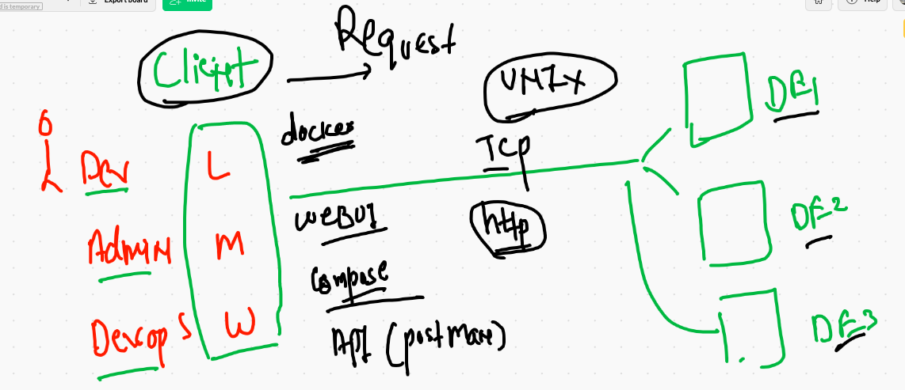
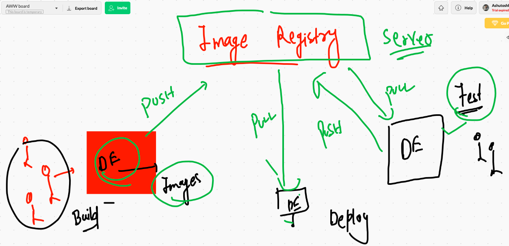
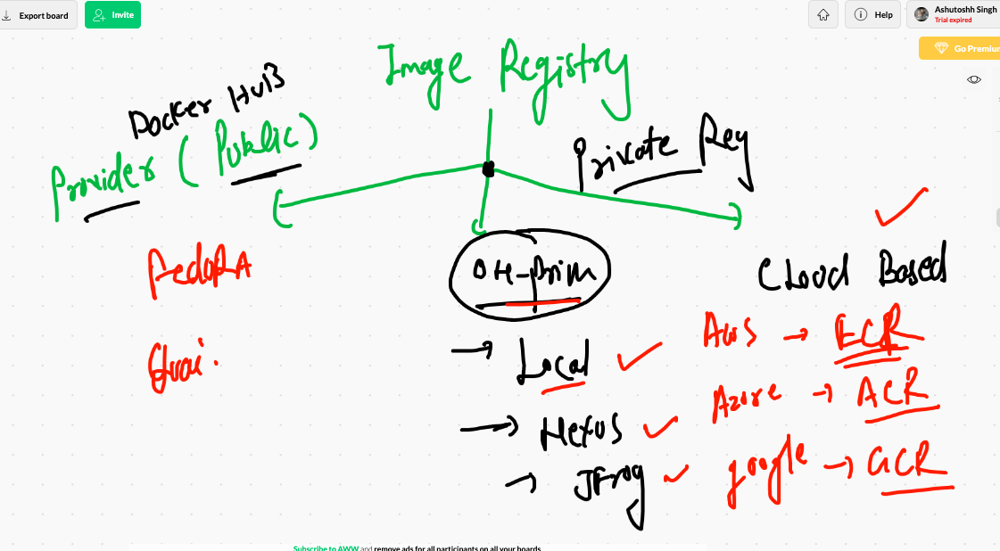
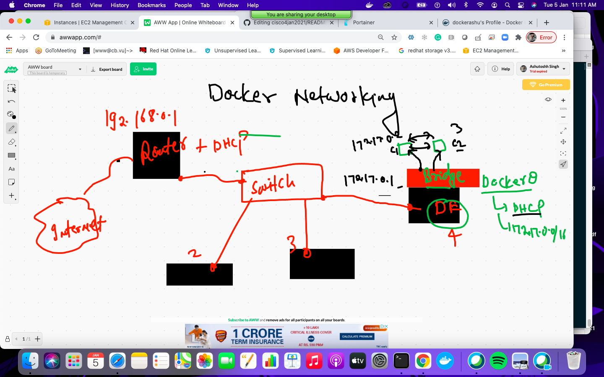
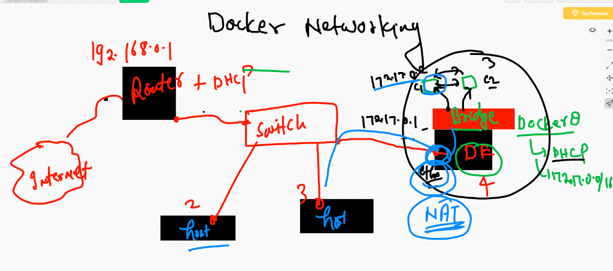
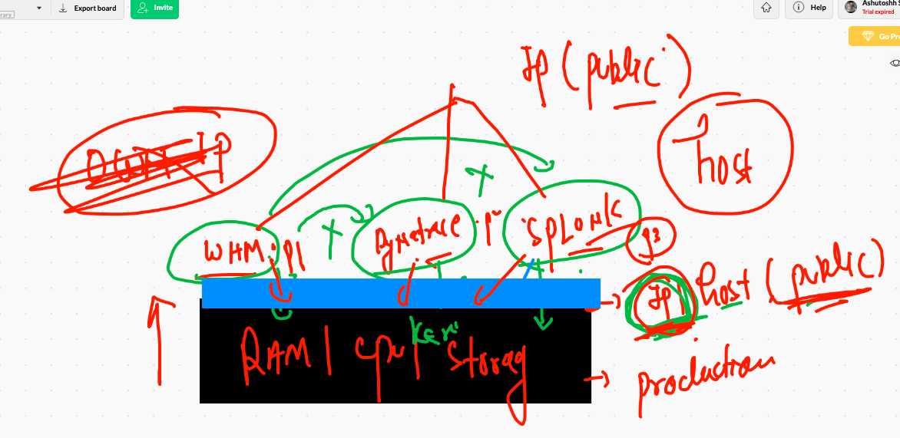
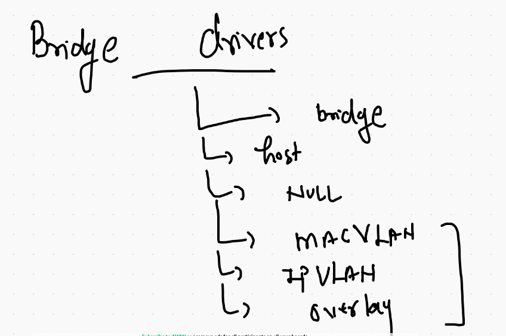
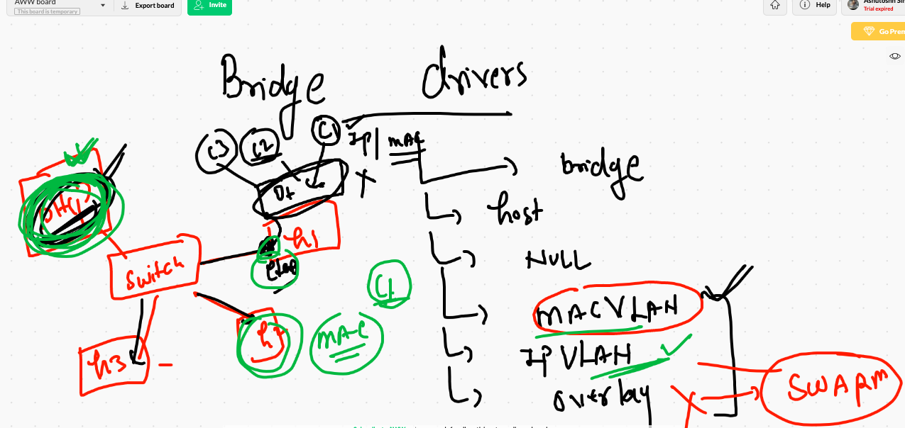

# Docker best practise 



## access docker engine from WEbUI  using portainer 

```
docker run -d --name ashuwebui -v /var/run/docker.sock:/var/run/docker.sock -p 9000:9000 portainer/portainer 
```

# image registry 



## type of image registry 



## Dockerfile 

```
[ec2-user@ip-172-31-6-16 project-html-website]$ cat  Dockerfile 
FROM nginx
MAINTAINER  ashutoshh@linux.com
WORKDIR  /usr/share/nginx/html/
COPY . . 
EXPOSE 80

```

## .dockerignore file 

```
[ec2-user@ip-172-31-6-16 project-html-website]$ cat .dockerignore 
Dockerfile
.dockerignore
.git
*.md
LICENSE

```

## building 
```
[ec2-user@ip-172-31-6-16 project-html-website]$ docker build  -t  ciscoweb:httpv1  . 
Sending build context to Docker daemon  833.5kB
Step 1/5 : FROM nginx
latest: Pulling from library/nginx
6ec7b7d162b2: Pull complete 
cb420a90068e: Pull complete 
2766c0bf2b07: Pull complete 
e05167b6a99d: Pull complete 
70ac9d795e79: Pull complete 
Digest: sha256:4cf620a5c81390ee209398ecc18e5fb9dd0f5155cd82adcbae532fec94006fb9
Status: Downloaded newer image for nginx:latest
 ---> ae2feff98a0c
Step 2/5 : MAINTAINER  ashutoshh@linux.com
 ---> Running in 81cf7f4ddc22
Removing intermediate container 81cf7f4ddc22
 ---> 8d723d43fca8
Step 3/5 : WORKDIR  /usr/share/nginx/html/
 ---> Running in 97e2e2180ecc
Removing intermediate container 97e2e2180ecc
 ---> ce9a3c934299
Step 4/5 : COPY . .
 ---> cca736bb5959
Step 5/5 : EXPOSE 80
 ---> Running in 101d9c66f93a
Removing intermediate container 101d9c66f93a
 ---> abffbd642bc9
Successfully built abffbd642bc9
Successfully tagged ciscoweb:httpv1

```


## image name reality 


## Pushing image to docker hub 

## loging to docker hub 

```
[ec2-user@ip-172-31-6-16 project-html-website]$ docker  login  
Login with your Docker ID to push and pull images from Docker Hub. If you don't have a Docker ID, head over to https://hub.docker.com to create one.
Username: dockerashu
Password: 
WARNING! Your password will be stored unencrypted in /home/ec2-user/.docker/config.json.
Configure a credential helper to remove this warning. See
https://docs.docker.com/engine/reference/commandline/login/#credentials-store

Login Succeeded

```
## pushing image on docker hub 

```
[ec2-user@ip-172-31-6-16 project-html-website]$ docker  tag  ciscoweb:httpv1   dockerashu/ciscoweb:httpv1 
[ec2-user@ip-172-31-6-16 project-html-website]$ docker push dockerashu/ciscoweb:httpv1 
The push refers to repository [docker.io/dockerashu/ciscoweb]
f5b390952830: Pushed 
4eaf0ea085df: Mounted from library/nginx 
2c7498eef94a: Mounted from library/nginx 
7d2b207c2679: Mounted from library/nginx 
5c4e5adc71a8: Mounted from library/nginx 
87c8a1d8f54f: Mounted from library/nginx 
httpv1: digest: sha256:79bf0bdcaec740853881f33d3a41214470315d7a1ee72c218468bf6b4fafd218 size: 1572

```

# Docker networking 

## default docker bridge 

```
[ec2-user@ip-172-31-6-16 ~]$ ifconfig  docker0
docker0: flags=4163<UP,BROADCAST,RUNNING,MULTICAST>  mtu 1500
        inet 172.17.0.1  netmask 255.255.0.0  broadcast 172.17.255.255
        inet6 fe80::42:6cff:fedb:162  prefixlen 64  scopeid 0x20<link>
        ether 02:42:6c:db:01:62  txqueuelen 0  (Ethernet)
        RX packets 9961  bytes 5572858 (5.3 MiB)
        RX errors 0  dropped 0  overruns 0  frame 0
        TX packets 9354  bytes 1327543 (1.2 MiB)
        TX errors 0  dropped 0 overruns 0  carrier 0  collisions 0
        
   ```
   
   
   ## docker0 bridge
   
   
   
   ## checking ip of container 
   
   ```
   docker inspect x1
   ===
         "Networks": {
                "bridge": {
                    "IPAMConfig": null,
                    "Links": null,
                    "Aliases": null,
                    "NetworkID": "49019c7e83f0ceff32e925d99bb088fc2d857f609d25b05ba119997cbe062812",
                    "EndpointID": "c002e27d6a0aeea09903069adc13adab9a0a6ca00c9c1e7a995e96fb835fd693",
                    "Gateway": "172.17.0.1",
                    "IPAddress": "172.17.0.2",
                    "IPPrefixLen": 16,
                    "IPv6Gateway": "",
                    "GlobalIPv6Address": "",
                    "GlobalIPv6PrefixLen": 0,
                    "MacAddress": "02:42:ac:11:00:02",
                    "DriverOpts": null
                }
            }
        }

```

## NAT 




# Bridges

```
[ec2-user@ip-172-31-6-16 ~]$ docker network ls
NETWORK ID          NAME                DRIVER              SCOPE
49019c7e83f0        bridge              bridge              local
6e677e6a1756        host                host                local
ed6ede4cc0ec        none                null                local
```

## Inspecting bridge 

```
[ec2-user@ip-172-31-6-16 ~]$ docker  network inspect  bridge 
[
    {
        "Name": "bridge",
        "Id": "49019c7e83f0ceff32e925d99bb088fc2d857f609d25b05ba119997cbe062812",
        "Created": "2021-01-05T04:09:46.251154981Z",
        "Scope": "local",
        "Driver": "bridge",
        "EnableIPv6": false,
        "IPAM": {
            "Driver": "default",
            "Options": null,
            "Config": [
                {
                    "Subnet": "172.17.0.0/16"
                }
            ]

```

## None bridge 

```
[ec2-user@ip-172-31-6-16 ~]$ docker run -it --rm  --network none  alpine sh 
/ # ifconfig 
lo        Link encap:Local Loopback  
          inet addr:127.0.0.1  Mask:255.0.0.0
          UP LOOPBACK RUNNING  MTU:65536  Metric:1
          RX packets:0 errors:0 dropped:0 overruns:0 frame:0
          TX packets:0 errors:0 dropped:0 overruns:0 carrier:0
          collisions:0 txqueuelen:1000 
          RX bytes:0 (0.0 B)  TX bytes:0 (0.0 B)

/ # ping google.com

```

## Host bridge



## remove all containers

```
[ec2-user@ip-172-31-6-16 ~]$ docker rm $(docker ps -aq) -f
afb0669a25e0
b3ec8c41502a
4bd1bee63225
66395cde4c59
700b0387b04a

```

## custom bridge 

```
[ec2-user@ip-172-31-6-16 ~]$ docker network create  ashubr1
88bb7324bebc1cd471d55df98b2aa7b9d3eacad14120d44ac7a20b56824e28ac
[ec2-user@ip-172-31-6-16 ~]$ docker network ls
NETWORK ID          NAME                DRIVER              SCOPE
88bb7324bebc        ashubr1             bridge              local
49019c7e83f0        bridge              bridge              local
6e677e6a1756        host                host                local
ed6ede4cc0ec        none                null                local
[ec2-user@ip-172-31-6-16 ~]$ docker network inspect ashubr1
[
    {
        "Name": "ashubr1",
        "Id": "88bb7324bebc1cd471d55df98b2aa7b9d3eacad14120d44ac7a20b56824e28ac",
        "Created": "2021-01-05T06:39:06.24444529Z",
        "Scope": "local",
        "Driver": "bridge",
        "EnableIPv6": false,
        "IPAM": {
            "Driver": "default",
            "Options": {},
            "Config": [
                {
                    "Subnet": "172.18.0.0/16",
                    "Gateway": "172.18.0.1"
                }
            ]
        },

```

## custom bridge with subnet 

```
[ec2-user@ip-172-31-6-16 ~]$ docker network create  ashubr2  --subnet  192.168.1.0/24  
435b166454092476d8ea71b3e2cfd8f7d39369297abb82ffc24ed8994bf86d21
[ec2-user@ip-172-31-6-16 ~]$ docker network inspect ashubr2
[
    {
        "Name": "ashubr2",
        "Id": "435b166454092476d8ea71b3e2cfd8f7d39369297abb82ffc24ed8994bf86d21",
        "Created": "2021-01-05T06:40:09.849638743Z",
        "Scope": "local",
        "Driver": "bridge",
        "EnableIPv6": false,
        "IPAM": {
            "Driver": "default",
            "Options": {},
            "Config": [
                {
                    "Subnet": "192.168.1.0/24"
                }
            ]

```

## more steps to custom bridge

```
100  docker network ls
  101  docker network create  ashubr1
  102  docker network ls
  103  docker network inspect ashubr1
  104  history 
  105  docker network create  ashubr2  --subnet  192.168.1.0/24  
  106  docker network inspect ashubr2
  107  history 
  108  docker network ls
  109  docker run -itd --name x1 --network ashubr1 alpine ping fb.com 
  110  docker run -itd --name x2 --network ashubr1 alpine ping google.com 
  111  docker  ps
  112  docker exec -it x1 sh 
  113  history 
  114  docker run -itd --name x3 --network ashubr2 alpine ping google.com 
  115  docker  ps
  116  docker exec -it x3 sh 
  117  history 
  118  docker run -itd --name x4 --network ashubr2  --ip 192.168.1.100   alpine ping google.com 
  119  docker ps
  120  docker exec -it x4 sh 

```

## connect 

```
/ # [ec2-user@ip-172-31-6-16 ~]$ docker network connect ashubr2 x1
[ec2-user@ip-172-31-6-16 ~]$ docker exec -it x1 sh 
/ # ifconfig 
eth0      Link encap:Ethernet  HWaddr 02:42:AC:12:00:02  
          inet addr:172.18.0.2  Bcast:172.18.255.255  Mask:255.255.0.0
          UP BROADCAST RUNNING MULTICAST  MTU:1500  Metric:1
          RX packets:613 errors:0 dropped:0 overruns:0 frame:0
          TX packets:594 errors:0 dropped:0 overruns:0 carrier:0
          collisions:0 txqueuelen:0 
          RX bytes:57770 (56.4 KiB)  TX bytes:56188 (54.8 KiB)

eth1      Link encap:Ethernet  HWaddr 02:42:C0:A8:01:03  
          inet addr:192.168.1.3  Bcast:192.168.1.255  Mask:255.255.255.0
          UP BROADCAST RUNNING MULTICAST  MTU:1500  Metric:1
          RX packets:6 errors:0 dropped:0 overruns:0 frame:0
          TX packets:0 errors:0 dropped:0 overruns:0 carrier:0
          collisions:0 txqueuelen:0 
          RX bytes:516 (516.0 B)  TX bytes:0 (0.0 B)


```


# Docker bridge drivers



## macvlan link

[docker] ('https://docs.docker.com/network/macvlan/')



