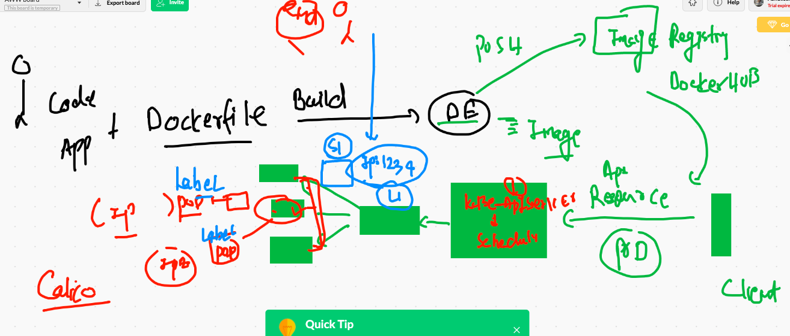
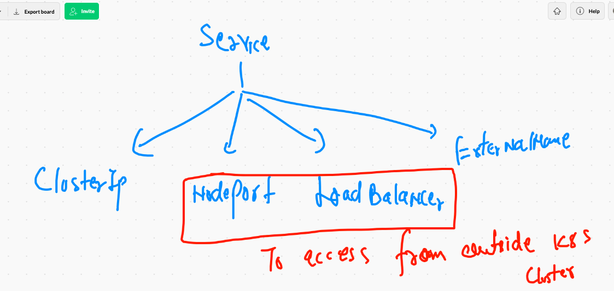
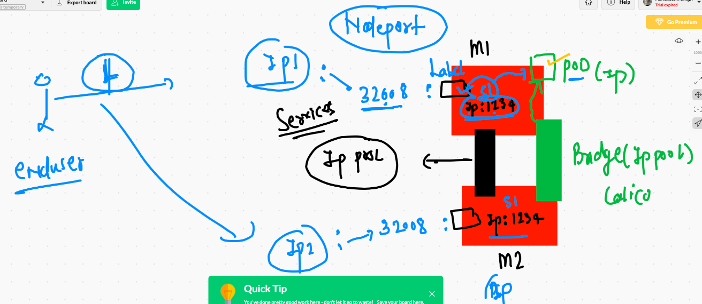
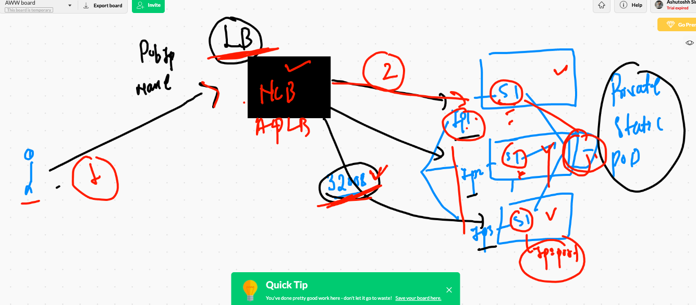

# service and pods in kubernetes 



## Java web app based POD 

```
kubectl  run  ashujavaapp --image=dockerashu/ciscojava:v009  --port 8080 --dry-run=client -o yaml >jsp.yml

```

## pod with labels 

```
❯ cat jsp.yml
apiVersion: v1
kind: Pod
metadata:
  creationTimestamp: null
  labels:  # lable of POD  key: value 
    x: ashujavaapp
  name: ashujavaapp  # name of my POD 
spec:
  containers:
  - image: dockerashu/ciscojava:v009 # image from docker hub 
    name: ashujavaapp  # name container 
    ports:
    - containerPort: 8080  # port of application 
    resources: {}
  dnsPolicy: ClusterFirst
  restartPolicy: Always
  
  ```
  
  ## checking labels and ip of PODs
  
  ```
  ❯ kubectl get po --show-labels
NAME             READY   STATUS    RESTARTS   AGE     LABELS
ashujavaapp      1/1     Running   0          2m23s   x=ashujavaapp
chandrajavaapp   1/1     Running   0          2m4s    run=chandrajavaapp
raithaljavaapp   1/1     Running   0          88s     run=raithaljavaapp
sauravjavaapp    1/1     Running   0          2m4s    run=sauravjavaapp
❯ kubectl get po --show-labels -o wide
NAME             READY   STATUS    RESTARTS   AGE     IP                NODE      NOMINATED NODE   READINESS GATES   LABELS
ashujavaapp      1/1     Running   0          2m47s   192.168.182.16    worker3   <none>           <none>            x=ashujavaapp
chandrajavaapp   1/1     Running   0          2m28s   192.168.189.80    worker2   <none>           <none>            run=chandrajavaapp
raithaljavaapp   1/1     Running   0          112s    192.168.189.81    worker2   <none>           <none>            run=raithaljavaapp
sauravjavaapp    1/1     Running   0          2m28s   192.168.235.138   worker1   <none>           <none>            run=sauravjavaapp

```

## type of service 



## NodePOrt service 




## Nodeport with LB 



## Nodeport Service creation 

```
❯ kubectl create  service  nodeport ashusvc1  --tcp 1123:8080  --dry-run=client -o yaml
apiVersion: v1
kind: Service
metadata:
  creationTimestamp: null
  labels:
    app: ashusvc1
  name: ashusvc1
spec:
  ports:
  - name: 1123-8080
    port: 1123
    protocol: TCP
    targetPort: 8080
  selector:
    app: ashusvc1
  type: NodePort
status:
  loadBalancer: {}
  
  ```
  
 ## service with updated selector label
 
 ```
 ❯ cat  mysvc1.yml
apiVersion: v1
kind: Service
metadata:
  creationTimestamp: null
  labels:
    app: ashusvc1
  name: ashusvc1
spec:
  ports:
  - name: 1123-8080
    port: 1123
    protocol: TCP
    targetPort: 8080
  selector:  # to find pod using labels 
   x: ashujavaapp  # label of POD 
  type: NodePort
status:
  loadBalancer: {}
  
 ```
  


