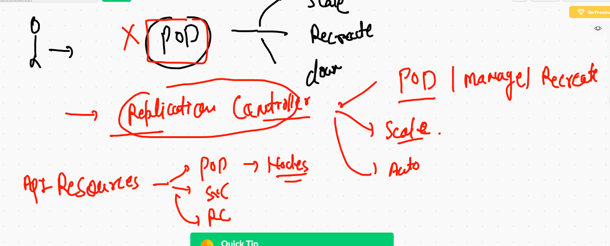
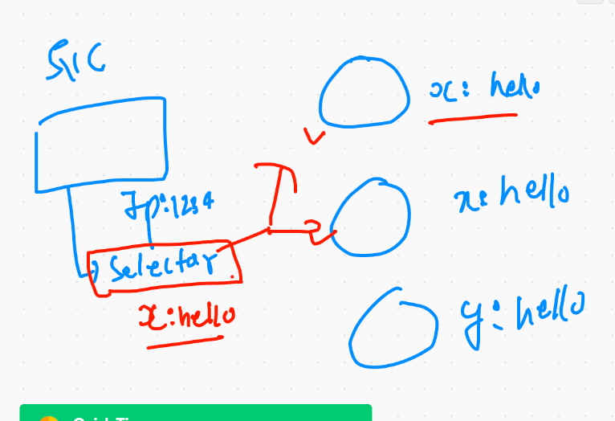

# service and pods in kubernetes 


## Java web app based POD 

```
kubectl  run  ashujavaapp --image=dockerashu/ciscojava:v009  --port 8080 --dry-run=client -o yaml >jsp.yml

```

## pod with labels 

```
❯ cat jsp.yml
apiVersion: v1
kind: Pod
metadata:
  creationTimestamp: null
  labels:  # lable of POD  key: value 
    x: ashujavaapp
  name: ashujavaapp  # name of my POD 
spec:
  containers:
  - image: dockerashu/ciscojava:v009 # image from docker hub 
    name: ashujavaapp  # name container 
    ports:
    - containerPort: 8080  # port of application 
    resources: {}
  dnsPolicy: ClusterFirst
  restartPolicy: Always
  
  ```
  
  ## checking labels and ip of PODs
  
  ## Deleting pod and service
  
  ```
  ❯ kubectl delete all --all
pod "ashujavaapp" deleted
pod "chandrajavaapp" deleted
pod "raithaljavaapp" deleted
pod "sauravjavaapp" deleted
pod "surabhijavaapp" deleted
service "ashusvc11" deleted
service "chandrasvc1" deleted
service "kubernetes" deleted
service "raithasvc1" deleted


```

# Replication controller 



## replication controller

```
❯ cat ashu-rc1.yaml
apiVersion: v1
kind: ReplicationController
metadata:
 name: ashurc-111
 labels:
  x: helloashu

spec:
 replicas: 1  # no of pod 
 template:
  metadata:
   labels:
    app: ashuapp1
  spec:
   containers:
   - image: nginx
     name: ashuc1
     ports:
     - containerPort: 80
     
```

## deployment of RC

```
❯ cat ashu-rc1.yaml
apiVersion: v1
kind: ReplicationController
metadata:
 name: ashurc-111
 labels:
  x: helloashu

spec:
 replicas: 1  # no of pod 
 template:
  metadata:
   labels:
    app: ashuapp1
  spec:
   containers:
   - image: nginx
     name: ashuc1
     ports:
     - containerPort: 80
❯ vim ashu-rc1.yaml
❯ kubectl apply -f  ashu-rc1.yaml
replicationcontroller/ashurc-111 created
❯ kubectl  get  rc
NAME         DESIRED   CURRENT   READY   AGE
ashurc-111   1         1         1       5s
❯ kubectl  get  po
NAME                  READY   STATUS    RESTARTS   AGE
ashurc-111-c24xw      1/1     Running   0          32s
chandrarc-111-9knb9   1/1     Running   0          24s
rag-rc-g76pd          1/1     Running   0          16s

```

  
  ```
  ❯ kubectl get po --show-labels
NAME             READY   STATUS    RESTARTS   AGE     LABELS
ashujavaapp      1/1     Running   0          2m23s   x=ashujavaapp
chandrajavaapp   1/1     Running   0          2m4s    run=chandrajavaapp
raithaljavaapp   1/1     Running   0          88s     run=raithaljavaapp
sauravjavaapp    1/1     Running   0          2m4s    run=sauravjavaapp
❯ kubectl get po --show-labels -o wide
NAME             READY   STATUS    RESTARTS   AGE     IP                NODE      NOMINATED NODE   READINESS GATES   LABELS
ashujavaapp      1/1     Running   0          2m47s   192.168.182.16    worker3   <none>           <none>            x=ashujavaapp
chandrajavaapp   1/1     Running   0          2m28s   192.168.189.80    worker2   <none>           <none>            run=chandrajavaapp
raithaljavaapp   1/1     Running   0          112s    192.168.189.81    worker2   <none>           <none>            run=raithaljavaapp
sauravjavaapp    1/1     Running   0          2m28s   192.168.235.138   worker1   <none>           <none>            run=sauravjavaapp

```

## type of service 


## NodePOrt service 


## Nodeport with LB 


## Nodeport Service creation 

```
❯ kubectl create  service  nodeport ashusvc1  --tcp 1123:8080  --dry-run=client -o yaml
apiVersion: v1
kind: Service
metadata:
  creationTimestamp: null
  labels:
    app: ashusvc1
  name: ashusvc1
spec:
  ports:
  - name: 1123-8080
    port: 1123
    protocol: TCP
    targetPort: 8080
  selector:
    app: ashusvc1
  type: NodePort
status:
  loadBalancer: {}
  
  ```
  
 ## service with updated selector label
 
 
 
 ```
 ❯ cat  mysvc1.yml
apiVersion: v1
kind: Service
metadata:
  creationTimestamp: null
  labels:
    app: ashusvc1
  name: ashusvc1
spec:
  ports:
  - name: 1123-8080
    port: 1123
    protocol: TCP
    targetPort: 8080
  selector:  # to find pod using labels 
   x: ashujavaapp  # label of POD 
  type: NodePort
status:
  loadBalancer: {}
  
 ```
  


## automatically match label of pod during service creation time 

```
❯ kubectl  expose pod ashujavaapp  --type NodePort --port 1234 --target-port 8080 --name ashusvc11
service/ashusvc11 exposed
❯ 
❯ kubectl  get  po
NAME             READY   STATUS    RESTARTS   AGE
ashujavaapp      1/1     Running   0          71m
chandrajavaapp   1/1     Running   0          70m
raithaljavaapp   1/1     Running   0          70m
sauravjavaapp    1/1     Running   0          70m
surabhijavaapp   1/1     Running   0          67m
❯ kubectl  get  svc
NAME         TYPE        CLUSTER-IP       EXTERNAL-IP   PORT(S)          AGE
ashusvc11    NodePort    10.111.230.121   <none>        1234:30140/TCP   9s
kubernetes   ClusterIP   10.96.0.1        <none>        443/TCP          45s

```

## hello
