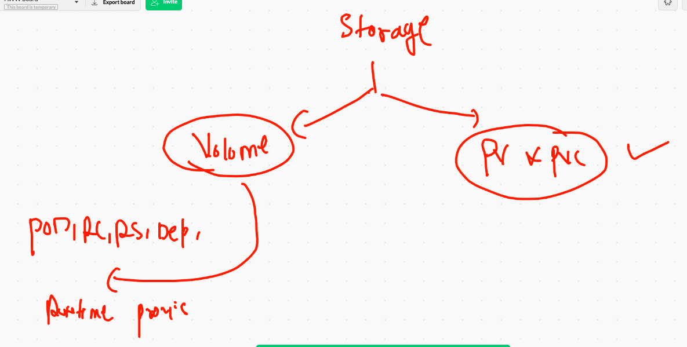

# FInal day

## kubernetes revision 


## type of storage 



## volume explain 


# EmptyDir Volume Example 

## pod creation 

```
❯ kubectl run  ashuemppod  --image=alpine  --command ping fb.com  --namespace ashu-space --dry-run=client -o yaml
apiVersion: v1
kind: Pod
metadata:
  creationTimestamp: null
  labels:
    run: ashuemppod
  name: ashuemppod
  namespace: ashu-space
spec:
  containers:
  - command:
    - ping
    - fb.com
    image: alpine
    name: ashuemppod
    resources: {}
  dnsPolicy: ClusterFirst
  restartPolicy: Always
status: {}
❯ kubectl run  ashuemppod  --image=alpine  --command ping fb.com  --namespace ashu-space --dry-run=client -o yaml >emppod.yml


```

## POD with Volume 

```

apiVersion: v1
kind: Pod
metadata:
  creationTimestamp: null
  labels:
    run: ashuemppod
  name: ashuemppod
  namespace: ashu-space
spec:
  volumes:
  - name: ashuvol1 # name of volume that will be created 
    emptyDir: {}  # will take storage from random location from that minion node where it will be scheduled
  containers:
  - command:
    - ping
    - fb.com
    image: alpine
    name: ashuemppod
    volumeMounts:
    - name: ashuvol1 # same volume as above we created 
      mountPath: /mnt/cisco #this directory will be created on the POD 
    resources: {}
  dnsPolicy: ClusterFirst
  restartPolicy: Always
  
  ```
  
  

