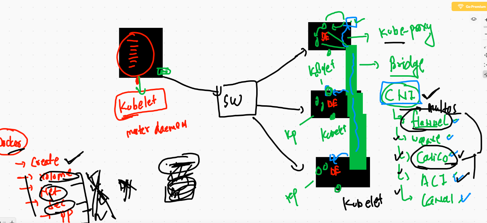

# Docker recap 


## creating and changing context 

```
❯ docker context create  remoteDE  --docker "host=tcp://52.66.251.242:2375"
remoteDE
Successfully created context "remoteDE"
❯ 
❯ docker  context  ls
NAME                TYPE                DESCRIPTION                               DOCKER ENDPOINT               KUBERNETES ENDPOINT   ORCHESTRATOR
default *           moby                Current DOCKER_HOST based configuration   unix:///var/run/docker.sock                         swarm
remoteDE            moby                                                          tcp://52.66.251.242:2375                            
❯ docker  context  use  remoteDE
remoteDE
❯ docker  context  ls
NAME                TYPE                DESCRIPTION                               DOCKER ENDPOINT               KUBERNETES ENDPOINT   ORCHESTRATOR
default             moby                Current DOCKER_HOST based configuration   unix:///var/run/docker.sock                         swarm
remoteDE *          moby                                                          tcp://52.66.251.242:2375                            


```

## Compose file versions


## compose file desing 


## compose example 1 

```
❯ cat docker-compose.yml
version: "3.8"
services:
 ashuwebapp1:  # name of service first 
  image: alpine
  container_name: ashuc1
  command: ping google.com
  
```

## Deploy in remote De 

```
❯ docker-compose up  -d
Creating network "ashuapp11_default" with the default driver
Creating ashuc1 ... done
❯ docker-compose ps
 Name        Command       State   Ports
----------------------------------------
ashuc1   ping google.com   Up           
❯ docker-compose ps
 Name        Command       State   Ports
----------------------------------------
ashuc1   ping google.com   Up           
❯ docker-compose logs
Attaching to ashuc1
ashuc1         | PING google.com (216.58.203.142): 56 data bytes
ashuc1         | 64 bytes from 216.58.203.142: seq=0 ttl=110 time=1.941 ms
ashuc1         | 64 bytes from 216.58.203.142: seq=1 ttl=110 time=1.979 ms
ashuc1         | 64 bytes from 216.58.203.142: seq=2 ttl=110 time=1.985 ms
ashuc1         | 64 bytes from 216.58.203

```


## Example 2 

```
❯ cat docker-compose.yml
version: "3.8"
services:
 ashuwebapp1:  # name of service first 
  image: alpine
  container_name: ashuc1
  command: ping google.com

 ashunginxapp1:  #  name of service second 
  image: nginx
  container_name: ashuc2
  ports:
   - "1199:80"
   
 ```
 
 ## compose related commands
 
 ```
 2979  docker  context  ls
 2980  docker-compose up  -d 
 2981  docker-compose ps
 2982  docker-compose logs 
 2983  ls
 2984  mv docker-compose.yml  ashu.yml
 2985  docker-compose ps
 2986  docker-compose -f  ashu.yml  ps 
 2987  docker-compose -f  ashu.yml  logs
 2988  history
 2989  ls
 2990  mv ashu.yml docker-compose.yml
 2991  docker-compose ps
 2992  docker-compose -v
 2993  docker-compose ps
 2994  docker-compose stop 
 2995  docker-compose ps
 2996  docker-compose start
 2997  history
 2998  docker-compose ps
 2999  docker-compose kill
 3000  docker context  ls
 3001  ls
 3002  docker-compose up -d
 3003  docker-compose -v
 3004  ls
 3005  docker-compose down 
 3006  history
 3007  ls
 3008  which docker-compose 
 3009  ls
 3010  vim  docker-compose.yml
 3011  cat docker-compose.yml
 3012  docker-compose up  -d
 3013  docker-compose ps
 3014  docker-compose kill  ashuwebapp1
 3015  docker-compose ps
 3016  docker-compose start
 3017  docker-compose ps
 3018  docker-compose  logs  ashuwebapp1
 3019  cat docker-compose.yml
 3020  docker-compose  logs  ashunginxapp1
 3021  history
 3022  cat  docker-compose.yml
 3023  docker-compose down
 
 ```
 
 ## docker cheet 
 
 [link] ('https://devhints.io/docker-compose')
 
 ## 
 
 docker-compose up --build  -d
 
 
# Container Orchestration Tools 


## GOogle history with k8s


## just overview of k8s & client architecture 


## k8s master componet explain 


## Minion node 



## system binary 


# K8s cluster deployment 


## Installing minikube 

[minikube] ('https://minikube.sigs.k8s.io/docs/start/')

## Installing minikube on Mac 

```
❯ curl -LO https://storage.googleapis.com/minikube/releases/latest/minikube-darwin-amd64
  % Total    % Received % Xferd  Average Speed   Time    Time     Time  Current
                                 Dload  Upload   Total   Spent    Left  Speed
100 54.8M  100 54.8M    0     0  6726k      0  0:00:08  0:00:08 --:--:-- 7957k
❯ sudo install minikube-darwin-amd64 /usr/local/bin/minikube
Password:
❯ minikube version
minikube version: v1.16.0
commit: 9f1e482427589ff8451c4723b6ba53bb9742fbb1

```

## deploy k8s cluster

```
❯ minikube start --driver=docker
😄  minikube v1.16.0 on Darwin 11.1
✨  Using the docker driver based on user configuration
👍  Starting control plane node minikube in cluster minikube
🚜  Pulling base image ...
🔥  Creating docker container (CPUs=2, Memory=1987MB) ...
🐳  Preparing Kubernetes v1.20.0 on Docker 20.10.0 ...
    ▪ Generating certificates and keys ...
    ▪ Booting up control plane ...
    ▪ Configuring RBAC rules ...
🔎  Verifying Kubernetes components...
🌟  Enabled addons: storage-provisioner, default-storageclass
🏄  Done! kubectl is now configured to use "minikube" cluster and "default" namespace by default

```

## Installation options


## Installing kubectl on Mac

```
❯ curl -LO "https://storage.googleapis.com/kubernetes-release/release/$(curl -s https://storage.googleapis.com/kubernetes-release/release/stable.txt)/bin/darwin/amd64/kubectl"
  % Total    % Received % Xferd  Average Speed   Time    Time     Time  Current
                                 Dload  Upload   Total   Spent    Left  Speed
100 44.0M  100 44.0M    0     0  5528k      0  0:00:08  0:00:08 --:--:-- 5747k
❯ chmod +x ./kubectl
❯ sudo mv ./kubectl /usr/local/bin/kubectl
Password:
❯ 
❯ kubectl version --client
Client Version: version.Info{Major:"1", Minor:"20", GitVersion:"v1.20.1", GitCommit:"c4d752765b3bbac2237bf87cf0b1c2e307844666", GitTreeState:"clean", BuildDate:"2020-12-18T12:09:25Z", GoVersion:"go1.15.5", Compiler:"gc", Platform:"darwin/amd64"}

```

## link of kubectl 

[install]  ('https://kubernetes.io/docs/tasks/tools/install-kubectl/')


## checking connection 

====

```
❯ minikube status
minikube
type: Control Plane
host: Running
kubelet: Running
apiserver: Running
kubeconfig: Configured
timeToStop: Nonexistent

❯ kubectl  cluster-info
Kubernetes control plane is running at https://127.0.0.1:32780
KubeDNS is running at https://127.0.0.1:32780/api/v1/namespaces/kube-system/services/kube-dns:dns/proxy

To further debug and diagnose cluster problems, use 'kubectl cluster-info dump'.
❯ 
❯ 
❯ kubectl  version
Client Version: version.Info{Major:"1", Minor:"20", GitVersion:"v1.20.1", GitCommit:"c4d752765b3bbac2237bf87cf0b1c2e307844666", GitTreeState:"clean", BuildDate:"2020-12-18T12:09:25Z", GoVersion:"go1.15.5", Compiler:"gc", Platform:"darwin/amd64"}
Server Version: version.Info{Major:"1", Minor:"20", GitVersion:"v1.20.0", GitCommit:"af46c47ce925f4c4ad5cc8d1fca46c7b77d13b38", GitTreeState:"clean", BuildDate:"2020-12-08T17:51:19Z", GoVersion:"go1.15.5", Compiler:"gc", Platform:"linux/amd64"}
❯ kubectl  get  nodes
NAME       STATUS   ROLES                  AGE    VERSION
minikube   Ready    control-plane,master   132m   v1.20.0

```

# POD vs container


## FIRst pod file

```
❯ cat  mypods/ashupod1.yaml
apiVersion: v1  # apiversion of k8s
kind: Pod  # resource type 
metadata:
 name: ashupod-1  # name of POD 

spec:  # about application 
 containers:
 - image: nginx
   name: ashuc1
   ports:
   - containerPort: 80
   
```

## checking syntax 

```
❯ kubectl apply -f  mypods/ashupod1.yaml  --dry-run=client
pod/ashupod-1 created (dry run)

```

## deploying POD

```
❯ kubectl  get  pods  --kubeconfig admin.conf
NAME          READY   STATUS              RESTARTS   AGE
ashupod-1     1/1     Running             0          2m
chandrapod1   0/1     ContainerCreating   0          4s
raithalpo-1   1/1     Running             0          71s
sauravpod1    1/1     Running             0          93s
surpod-1      1/1     Running             0          2m1s
❯ kubectl  get  nodes   --kubeconfig admin.conf
NAME        STATUS   ROLES                  AGE    VERSION
k8smaster   Ready    control-plane,master   144m   v1.20.1
worker1     Ready    <none>                 143m   v1.20.1
worker2     Ready    <none>                 143m   v1.20.1
worker3     Ready    <none>                 142m   v1.20.1
❯ kubectl  get  pods  --kubeconfig admin.conf  -o wide
NAME          READY   STATUS    RESTARTS   AGE     IP                NODE      NOMINATED NODE   READINESS GATES
ashupod-1     1/1     Running   0          2m31s   192.168.235.130   worker1   <none>           <none>
chandrapod1   1/1     Running   0          35s     192.168.189.67    worker2   <none>           <none>
raithalpo-1   1/1     Running   0          102s    192.168.182.3     worker3   <none>           <none>
sauravpod1    1/1     Running   0          2m4s    192.168.189.66    worker2   <none>           <none>
surpod-1      1/1     Running   0          2m32s   192.168.182.2     worker3   <none>           <none>

```

## Describe POd

```
❯ kubectl describe pod  ashupod-1
Name:         ashupod-1
Namespace:    default
Priority:     0
Node:         worker1/172.31.16.174
Start Time:   Wed, 06 Jan 2021 15:26:13 +0530
Labels:       <none>
Annotations:  cni.projectcalico.org/podIP: 192.168.235.130/32
              cni.projectcalico.org/podIPs: 192.168.235.130/32
Status:       Running
IP:           192.168.235.130
IPs:
  IP:  192.168.235.130
Containers:
  ashuc1:
    Container ID:   docker://036fbe91187659f829afd2f4644ffb1e8aefe33b9f0d56dd8ecf9225ac3f4f44
    Image:          nginx
    Image ID:       docker-pullable://nginx@sha256:4cf620a5c81390ee209398ecc18e5fb9dd0f5155cd82adcbae532fec94006fb9
    Port:           80/TCP


```

## access container 

```
❯ kubectl  exec -it  ashupod-1 -- bash
root@ashupod-1:/# 
root@ashupod-1:/# 
root@ashupod-1:/# cat  /etc/os-release 
PRETTY_NAME="Debian GNU/Linux 10 (buster)"
NAME="Debian GNU/Linux"
VERSION_ID="10"
VERSION="10 (buster)"
VERSION_CODENAME=buster
ID=debian
HOME_URL="https://www.debian.org/"
SUPPORT_URL="https://www.debian.org/support"
BUG_REPORT_URL="https://bugs.debian.org/"
root@ashupod-1:/# uname -r
4.14.209-160.339.amzn2.x86_64

```
## checking logs 

```
❯ kubectl logs    ashupod-1
/docker-entrypoint.sh: /docker-entrypoint.d/ is not empty, will attempt to perform configuration
/docker-entrypoint.sh: Looking for shell scripts in /docker-entrypoint.d/
/docker-entrypoint.sh: Launching /docker-entrypoint.d/10-listen-on-ipv6-by-default.sh
10-listen-on-ipv6-by-default.sh: info: Getting the checksum of /etc/nginx/conf.d/default.conf
10-listen-on-ipv6-by-default.sh: info: Enabled listen on IPv6 in /etc/nginx/conf.d/default.conf
/docker-entrypoint.sh: Launching /docker-entrypoint.d/20-envsubst-on-templates.sh
/docker-entrypoint.sh: Configuration complete; ready for start up

```

## deleting pOD

```
❯ kubectl  delete pod ashupod-1
pod "ashupod-1" deleted
❯ kubectl get  po
NAME          READY   STATUS    RESTARTS   AGE
chandrapod1   1/1     Running   0          25m
sauravpod1    1/1     Running   0          26m
surpod-1      1/1     Running   0          27m
❯ kubectl  delete pod --all
pod "chandrapod1" deleted
pod "sauravpod1" deleted
pod "surpod-1" deleted

```

# autogen of YAML for POD

```
 kubectl  run  ashupod2  --image=nginx --port 80 --dry-run=client -o yaml
apiVersion: v1
kind: Pod
metadata:
  creationTimestamp: null
  labels:
    run: ashupod2
  name: ashupod2
spec:
  containers:
  - image: nginx
    name: ashupod2
    ports:
    - containerPort: 80
    resources: {}
  dnsPolicy: ClusterFirst
  restartPolicy: Always
status: {}

```

## YAML based deployment 

```
❯ kubectl  run  ashupod2  --image=nginx --port 80 --dry-run=client -o yaml
apiVersion: v1
kind: Pod
metadata:
  creationTimestamp: null
  labels:
    run: ashupod2
  name: ashupod2
spec:
  containers:
  - image: nginx
    name: ashupod2
    ports:
    - containerPort: 80
    resources: {}
  dnsPolicy: ClusterFirst
  restartPolicy: Always
status: {}
❯ kubectl  run  ashupod2  --image=nginx --port 80 --dry-run=client -o yaml  >ashupod2.yml
❯ ls
ashupod1.yaml ashupod2.yml
❯ kubectl  apply -f  ashupod2.yml
pod/ashupod2 created
❯ kubectl get po
NAME       READY   STATUS              RESTARTS   AGE
ashupod2   0/1     ContainerCreating   0          4s

```
# JSOn pod file 

```
kubectl  run  myapp  --image=dockerashu/ciscoweb:httpv1  --port 80 --dry-run=client -o json  >web.json

```

## accessing application using 

```
❯ kubectl  port-forward  myapp  8899:80
Forwarding from 127.0.0.1:8899 -> 80
Forwarding from [::1]:8899 -> 80

```

## access application problems with POD 


## pod with Label concept 


