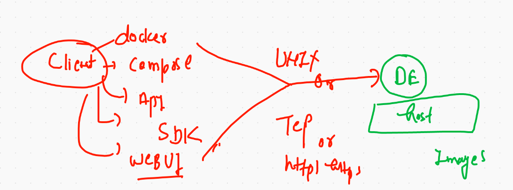

# Getting started with Docker & containers

## app history 


## Build process of container with host kernel


## vm vs container provides


# Container by Docker & mirantis


## Docker installation 


## Docker Desktop for Mac 

[docker desktop] ('https://hub.docker.com/editions/community/docker-ce-desktop-mac')


# INstalling Docker in Linux server 

```
[ec2-user@ip-172-31-15-194 ~]$ sudo yum  install  docker 
Failed to set locale, defaulting to C
Loaded plugins: extras_suggestions, langpacks, priorities, update-motd
amzn2-core                                                         | 3.7 kB  00:00:00     
Resolving Dependencies
--> Running transaction check
---> Package docker.x86_64 0:19.03.13ce-1.amzn2 will be installed
--> Processing Dependency: runc >= 1.0.0 for package: docker-19.03.13ce-1.amzn2.x86_64
--> Processing Dependency: containerd >= 1.3.2 for package: docker-19.03.13ce-1.amzn2.x86_64
--> Processing Dependency: pigz for package: docker-19.03.13ce-1.amzn2.x86_64
--> Processing Dependency: libcgroup for package: docker-19.03.13ce-1.amzn2.x86_64
--> Running transaction check

```

## checking installation 

```
[ec2-user@ip-172-31-15-194 ~]$ docker  version 
Client:
 Version:           19.03.13-ce
 API version:       1.40
 Go version:        go1.13.15
 Git commit:        4484c46
 Built:             Mon Oct 12 18:51:20 2020
 OS/Arch:           linux/amd64
 Experimental:      false
Cannot connect to the Docker daemon at unix:///var/run/docker.sock. Is the docker daemon running?
```

## starting docker engine 

```
[ec2-user@ip-172-31-15-194 ~]$ sudo systemctl start docker 
[ec2-user@ip-172-31-15-194 ~]$ sudo systemctl enable  docker 
Created symlink from /etc/systemd/system/multi-user.target.wants/docker.service to /usr/lib/systemd/system/docker.service.

```

## starting 

```
[ec2-user@ip-172-31-15-194 ~]$ sudo systemctl status  docker 
● docker.service - Docker Application Container Engine
   Loaded: loaded (/usr/lib/systemd/system/docker.service; enabled; vendor preset: disabled)
   Active: active (running) since Mon 2021-01-04 06:08:12 UTC; 52s ago
     Docs: https://docs.docker.com
 Main PID: 3958 (dockerd)
   CGroup: /system.slice/docker.ser
   
 ```
 
 ## Connecting to Docker engine 
 
 ```
 [ec2-user@ip-172-31-15-194 ~]$ docker version 
Client:
 Version:           19.03.13-ce
 API version:       1.40
 Go version:        go1.13.15
 Git commit:        4484c46
 Built:             Mon Oct 12 18:51:20 2020
 OS/Arch:           linux/amd64
 Experimental:      false
Got permission denied while trying to connect to the Docker daemon socket at unix:///var/run/docker.sock: Get http://%2Fvar%2Frun%2Fdocker.sock/v1.40/version: dial unix /var/run/docker.sock: connect: permission denied

```

## adding non root user to Docker group 

```
[ec2-user@ip-172-31-15-194 ~]$ sudo usermod -a -G docker ec2-user 
[ec2-user@ip-172-31-15-194 ~]$ logout
Connection to 35.154.0.70 closed.
❯ ssh -i Downloads/cisco.pem ec2-user@35.154.0.70
Last login: Mon Jan  4 05:39:02 2021 from 103.22.142.170


```

## now checking 

```
ec2-user@ip-172-31-15-194 ~]$ docker version 
Client:
 Version:           19.03.13-ce
 API version:       1.40
 Go version:        go1.13.15
 Git commit:        4484c46
 Built:             Mon Oct 12 18:51:20 2020
 OS/Arch:           linux/amd64
 Experimental:      false

Server:
 Engine:
  Version:          19.03.13-ce
  API version:      1.40 (minimum version 1.12)
  Go version:       go1.13.15
  Git commit:       4484c46
  Built:            Mon Oct 12 18:51:50 2020
  OS/Arch:          linux/amd64
  Experimental:     false
 containerd:
  Version:          1.4.1
  GitCommit:        c623d1b36f09f8ef6536a057bd658b3aa8632828
 runc:
  Version:          1.0.0-rc92
  GitCommit:        ff819c7e9184c13b7c2607fe6c30ae19403a7aff
 docker-init:
  Version:          0.19.0
  GitCommit:        de40ad0

```

## searching images on docker hub 

```
17  docker  images
   18  docker search python 
   19  docker search  java
   20  history 
   21  docker search  dockerashu
   22  docker search  ashutoshh 
   
   ```
   
   
## pulling docker images from docker hub 

```
 25  docker pull java 
   26  docker pull  python 
   27  docker pull  tomcat 
   28  history 
[ec2-user@ip-172-31-15-194 ~]$ docker images
REPOSITORY          TAG                 IMAGE ID            CREATED             SIZE
tomcat              latest              feba8d001e3f        2 weeks ago         649MB
python              latest              d1eef6fb8dbe        2 weeks ago         885MB
java                latest              d23bdf5b1b1b        3 years ago         643MB

```
## Docker internal configuration 

```
[ec2-user@ip-172-31-15-194 ~]$ cd /var/lib/docker/
[ec2-user@ip-172-31-15-194 docker]$ ls
ls: cannot open directory .: Permission denied
[ec2-user@ip-172-31-15-194 docker]$ sudo -i
[root@ip-172-31-15-194 ~]# cd /var/lib/docker/
[root@ip-172-31-15-194 docker]# ls
builder  buildkit  containers  image  network  overlay2  plugins  runtimes  swarm  tmp  trust  volumes
[root@ip-172-31-15-194 docker]# 

```
## Docker client options 



# first container 

```
[ec2-user@ip-172-31-15-194 ~]$ docker   run  --name ashuc1  alpine:latest  ping fb.com 
PING fb.com (157.240.16.35): 56 data bytes
64 bytes from 157.240.16.35: seq=0 ttl=49 time=1.156 ms
64 bytes from 157.240.16.35: seq=1 ttl=49 time=1.153 ms
64 bytes from 157.240.16.35: seq=2 ttl=49 time=1.845 ms
64 bytes from 157.240.16.35: seq=3 ttl=49 time=1.263 ms
64 bytes from 157.240.16.35: seq=4 ttl=49 time=1.198 ms
64 bytes from 157.240.16.35: seq=5 ttl=49 time=1.141 ms
64 bytes from 157.240.16.35: seq=6 ttl=49 time=1.237 ms
64 bytes from 157.240.16.35: seq=7 ttl=49 time=1.289 ms
64 bytes from 157.240.16.35: seq=8 ttl=49 time=1.144 ms
64 bytes from 157.240.16.35: seq=9 ttl=49 time=1.190 ms
64 bytes from 157.240.16.35: seq=10 ttl=49 time=1.197 ms
64 bytes from 157.240.16.35: seq=11 ttl=49 time=1.176 ms
64 bytes from 157.240.16.35: seq=12 ttl=49 time=1.240 ms
64 bytes from 157.240.16.35: seq=13 ttl=49 time=1.174 ms
64 bytes from 157.240.16.35: seq=14 ttl=49 time=1.275 ms
^C
--- fb.com ping statistics ---
15 packets transmitted, 15 packets received, 0% packet loss
round-trip min/avg/max = 1.141/1.245/1.845 ms

```
## checking container status

```
[ec2-user@ip-172-31-15-194 ~]$ docker   ps
CONTAINER ID        IMAGE               COMMAND             CREATED             STATUS              PORTS               NAMES
[ec2-user@ip-172-31-15-194 ~]$ 
[ec2-user@ip-172-31-15-194 ~]$ docker   ps -a
CONTAINER ID        IMAGE               COMMAND             CREATED             STATUS                          PORTS               NAMES
0396a2d549ed        alpine:latest       "ping fb.com"       2 minutes ago       Exited (0) About a minute ago                       ashuc1


```

## starting container 

```
[ec2-user@ip-172-31-15-194 ~]$ docker  start  ashuc1
ashuc1

[ec2-user@ip-172-31-15-194 ~]$ docker  ps  
CONTAINER ID        IMAGE               COMMAND             CREATED             STATUS              PORTS               NAMES
0396a2d549ed        alpine:latest       "ping fb.com"       4 minutes ago       Up 5 seconds                            ashuc1

```

## checkout output of contaier parent process

```
 50  docker  logs   ashuc1  
   51  docker  logs   -f  ashuc1 
 ```
 
 ## child process in container a running container 
 
 ```
 [ec2-user@ip-172-31-15-194 ~]$ docker  exec  ashuc1  ping 8.8.8.8
PING 8.8.8.8 (8.8.8.8): 56 data bytes
64 bytes from 8.8.8.8: seq=0 ttl=110 time=2.491 ms
64 bytes from 8.8.8.8: seq=1 ttl=110 time=2.586 ms
64 bytes from 8.8.8.8: seq=2 ttl=110 time=2.525 ms
64 bytes from 8.8.8.8: seq=3 ttl=110 time=2.597 ms
64 bytes from 8.8.8.8: seq=4 ttl=110 time=2.516 ms
64 bytes from 8.8.8.8: seq=5 ttl=110 time=2.496 ms
64 bytes from 8.8.8.8: seq=6 ttl=110 time=2.549 ms
64 bytes from 8.8.8.8: seq=7 ttl=110 time=2.486 ms
64 bytes from 8.8.8.8: seq=8 ttl=110 time=2.476 ms
64 bytes from 8.8.8.8: seq=9 ttl=110 time=2.700 ms
64 bytes from 8.8.8.8: seq=10 ttl=110 time=2.470 ms
64 bytes from 8.8.8.8: seq=11 ttl=110 time=2.546 ms
64 bytes from 8.8.8.8: seq=12 ttl=110 time=2.549 ms
^C
[ec2-user@ip-172-31-15-194 ~]$ docker  ps
CONTAINER ID        IMAGE               COMMAND             CREATED             STATUS              PORTS               NAMES
0396a2d549ed        alpine:latest       "ping fb.com"       17 minutes ago      Up 9 minutes                            ashuc1
[ec2-user@ip-172-31-15-194 ~]$ docker  exec  -d  ashuc1  ping 8.8.8.8
[ec2-user@ip-172-31-15-194 ~]$ docker  ps
CONTAINER ID        IMAGE               COMMAND             CREATED             STATUS              PORTS               NAMES
0396a2d549ed        alpine:latest       "ping fb.com"       17 minutes ago      Up 9 minutes 
```

## accessing container shell

```
[ec2-user@ip-172-31-15-194 ~]$ docker  exec -it ashuc1  sh 
/ # uname 
Linux
/ # uname -r
4.14.209-160.339.amzn2.x86_64
/ # cat  /etc/os-release 
NAME="Alpine Linux"
ID=alpine
VERSION_ID=3.12.3
PRETTY_NAME="Alpine Linux v3.12"
HOME_URL="https://alpinelinux.org/"
BUG_REPORT_URL="https://bugs.alpinelinux.org/"

```

# Containerization of applications 


## python script with dockerfile 

```
[ec2-user@ip-172-31-15-194 pythonapp]$ cat ashu.py 
import  subprocess
import time 
k=subprocess.getoutput('uname -r')
cont=subprocess.getoutput('date')

while 4 > 2 :
    print("Hello world")
    print("docker is running in kernel version ",k)
    time.sleep(2)
    print("current time and date is",cont)
    
```


## converting into docker image 

## dockerfile

```
[ec2-user@ip-172-31-15-194 pythonapp]$ cat Dockerfile 
FROM python 
#  using some base image 
MAINTAINER  ashutoshh@linux.com
# optional but good 
RUN mkdir  /mycode 
COPY  ashu.py  /mycode/ashu.py
#  make sure dockerfile & code like ashu.py are at same location 
# only current location things gonna used in copy instructions 
WORKDIR  /mycode
#  like cd in linux 
# to change directory during build time of docker image 
RUN chmod +x ashu.py
# to run any command 
CMD  ["python","ashu.py"]

# only CMD can be the one to define the default parent process 
#  this is used for deciding the default parent process

```

## building docker images

```
ec2-user@ip-172-31-15-194 pythonapp]$ docker build  -t   python:ashucode   . 
Sending build context to Docker daemon  3.584kB
Step 1/7 : FROM python
 ---> d1eef6fb8dbe
Step 2/7 : MAINTAINER  ashutoshh@linux.com
 ---> Running in 121bbc70b0e2
Removing intermediate container 121bbc70b0e2
 ---> f3b2dc828f06
Step 3/7 : RUN mkdir  /mycode
 ---> Running in 45bfa003bf02
Removing intermediate container 45bfa003bf02
 ---> 8bbb968b6331
Step 4/7 : COPY  ashu.py  /mycode/ashu.py
 ---> 4dc81c32bc75
Step 5/7 : WORKDIR  /mycode
 ---> Running in 810d21cb6da9
Removing intermediate container 810d21cb6da9
 ---> b7fda4deea24
Step 6/7 : RUN chmod +x ashu.py
 ---> Running in ab3cb53a17cd
Removing intermediate container ab3cb53a17cd
 ---> 34863daa425b
Step 7/7 : CMD  ["python","ashu.py"]
 ---> Running in 1d67821ae0bb
Removing intermediate container 1d67821ae0bb
 ---> b89e1e70e49c
Successfully built b89e1e70e49c
Successfully tagged python:ashucode
[ec2-user@ip-172-31-15-194 pythonapp]$ docker  images
REPOSITORY          TAG                 IMAGE ID            CREATED             SIZE
python              ashucode            b89e1e70e49c        12 seconds ago      885MB
busybox             latest              a77dce18d0ec        5 days ago          1.24MB
tomcat              latest              feba8d001e3f        2 weeks ago         649MB

```

## Dockerfile build operation 

## systemctl & systemd  concept in container


## webapp with httpd server 

### Dockerfile 

```
cat ashu.dockerfile 
FROM centos
MAINTAINER  ashutoshh@linux.com ,9509957594
RUN yum install httpd -y
WORKDIR  /var/www/html/
#  /var/www/html/ is the place from where httpd can read the web app 
COPY app  .  
EXPOSE 80
CMD ["httpd","-D","FOREGROUND"]
# systemctl is calling a script to start any process 

```

### .dockerignore 

```
[ec2-user@ip-172-31-15-194 webapp1]$ cat .dockerignore 
ashu.dockerfile
app/.git
app/*.md
app/LICENSE 
.dockerignore

```

## building image 

```
[ec2-user@ip-172-31-15-194 webapp1]$ docker  build  -t   htmlwebapp:ashuv0011  -f  ashu.dockerfile   . 
Sending build context to Docker daemon     64kB
Step 1/7 : FROM centos
latest: Pulling from library/centos
7a0437f04f83: Pull complete 
Digest: sha256:5528e8b1b1719d34604c87e11dcd1c0a20bedf46e83b5632cdeac91b8c04efc1
Status: Downloaded newer image for centos:latest
 ---> 300e315adb2f
Step 2/7 : MAINTAINER  ashutoshh@linux.com ,9509957594
 ---> Running in 221a238cff57
Removing intermediate container 221a238cff57


```
## creating container 

```
[ec2-user@ip-172-31-15-194 webapp1]$ docker run --name  app11    -d  -p  1122:80    766e926aba65  
c62ddeae5f6415fb04dbcb73e91c2baf832154bf6cbd35a25877e12f27f45675
[ec2-user@ip-172-31-15-194 webapp1]$ docker ps 
CONTAINER ID        IMAGE               COMMAND                 CREATED             STATUS              PORTS                  NAMES
c62ddeae5f64        766e926aba65        "httpd -D FOREGROUND"   6 seconds ago       Up 5 seconds        0.0.0.0:1122->80/tcp   app11
879892dea998        python:ashucode     "python ashu.py"        2 hours ago         Up 2 hours                             

```
## dockerfile with entrypoint process

```
[ec2-user@ip-172-31-15-194 webapp1]$ cat  ashu.dockerfile 
FROM centos
MAINTAINER  ashutoshh@linux.com ,9509957594
RUN yum install httpd -y
WORKDIR  /var/www/html/
#  /var/www/html/ is the place from where httpd can read the web app 
COPY app  .  
EXPOSE 80
ENTRYPOINT httpd  -DFOREGROUND
# systemctl is calling a script to start any process 

```

## image build without using previoud build cache 

```
docker  build  -t   htmlwebapp:ashuv0022  -f  ashu.dockerfile --no-cache   .

```
## CMD & ENTrypoint all together

```
[ec2-user@ip-172-31-15-194 pythonapp]$ cat Dockerfile 
FROM python 
#  using some base image 
MAINTAINER  ashutoshh@linux.com
# optional but good 
RUN mkdir  /mycode 
COPY  ashu.py  /mycode/ashu.py
COPY  cisco.py  /mycode/cisco.py
#  make sure dockerfile & code like ashu.py are at same location 
# only current location things gonna used in copy instructions 
WORKDIR  /mycode
#  like cd in linux 
# to change directory during build time of docker image 
RUN chmod +x ashu.py cisco.py 
# to run any command 
ENTRYPOINT  ["python"]
# is fixed 
CMD  ["ashu.py"]
# dynamic 

# only CMD can be the one to define the default parent process 
#  this is used for deciding the default parent process

```


## replacing entrypoint based parent process

```
docker run -d --name x4 -it  --entrypoint ping  python:v1122 google.com
```

# Task 1 : 

create two containers and do the given things
● Image must be alpine
● Name of container <yourname>c1 & <yourname>c2
● Parent process you can choose accordingly
● Create two files in container1 named aa.txt & bb.txt
● Now copy aa.txt into second container


# answer 

```
238  docker run -it --name ashuc11  alpine  sh 
  239  docker  start  ashuc11 
  240  docker run -itd --name ashuc22  alpine  sh 
  241  docker  ps
  242  docker  cp  ashuc11:/aa.txt  . 
  243  ls
  244  docker cp  aa.txt    ashuc22:/
  245  docker exec -it  ashuc22 sh 

```

# namespace in docker container 


## cgroups 

```
$ docker  run -d --name xc11 --memory 100m  --cpu-shares=30  alpine ping fb.com 

```
## update cgroup

```
262  docker  run -d --name xc11 --memory 100m alpine ping fb.com 
  263  docker stats
  264  docker update xc11 --memory 500m 
  265  docker update xc11 --help
  266  docker update xc11 --memory-swap 500m 
  267  docker stats
  268  docker update xc11 --memory 500m 
  
  ```
  
  
